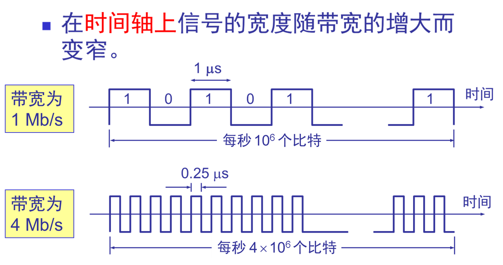
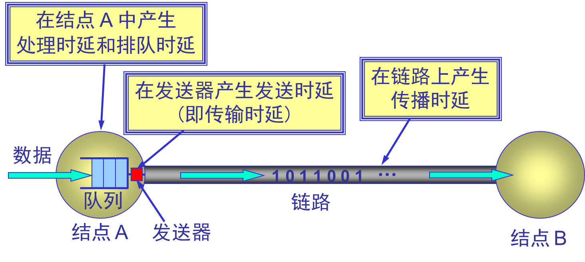
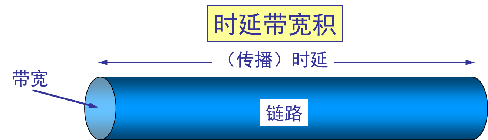
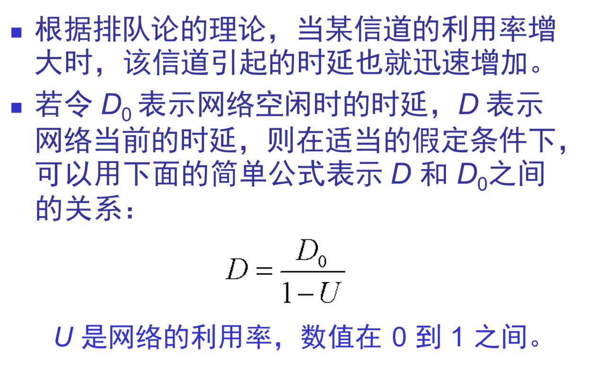
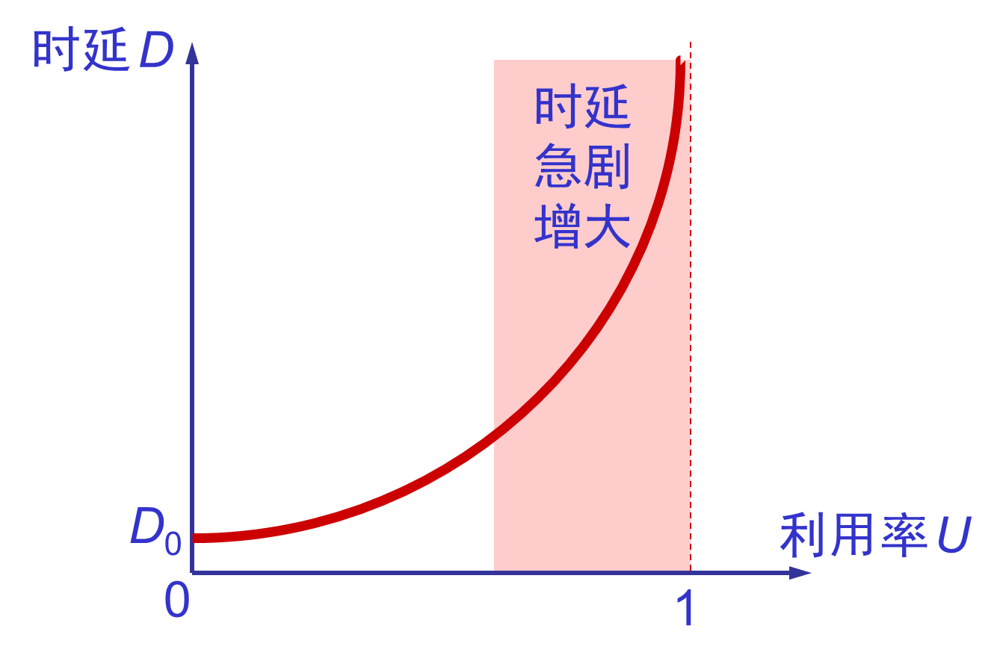
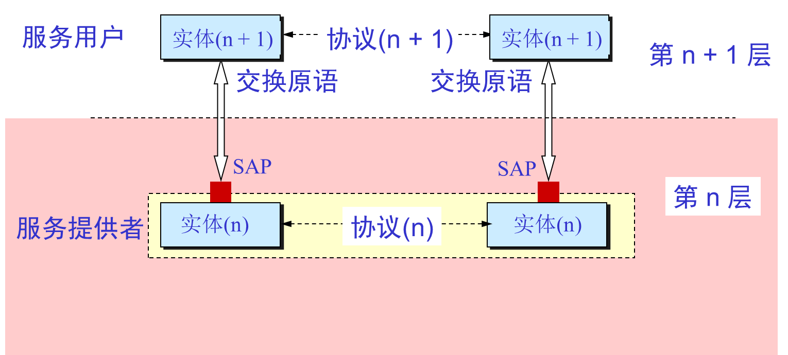

# 第一章 计算机网络概述

## 1.1 计算机网络在信息时代的作用

二十一世纪：数字化、网络化、信息化。

三网：电信网络、计算机网络、有线电视网络

计算机网络：因特网、其他网络。

计算机网络的重要功能：连通性、共享。

****

## 1.2 因特网概述

**网络**

许多计算机连接在一起

**互联网（internet）**

许多网络连接在一起

**因特网（Internet）**

全球最大的一个互联网

因特网发展的三个阶段

| 上世纪60年代到80年代中期 | 上世纪80年代中期到90年代初 | 90年代初到如今            |
| ------------------------ | -------------------------- | ------------------------- |
| **ARPANET**向互联网发展  | **三级结构**的因特网       | **多层次ISP**结构的因特网 |

因特网的标准化工作

****

## 1.3 因特网的组成

因特网：边缘部分、核心部分。

边缘部分：客户服务器（CS）方式、对等（P2P）方式。

核心部分：电路交换、报文交换、分组交换。

### 1.3.1 边缘部分的通信方式

客户服务器方式：

对等方式：

### 1.3.2 核心部分数据交换方式

- 电路交换

  

  1. 建立连接
  2. 通话
  3. 释放连接

  

- 报文交换

  采用存储转发直接传输整个报文。

  交换的时延较长。

- 分组交换

  1. 在发送段，先把较长的报文**划分成较短的、固定长度的数据段。**
  2. 每一个数据段前面添加上**首部**构成分组。
  3. 分组交换网以“**分组**”作为数据传输单元。
  4. **依次**把各分组发送到接收端。
  5. 接收端收到分组后**剥去首部**还原成报文。
  6. 最后，在接收端把收到的所有数据**整合**成原来的报文。

  - 优点：高效、灵活、迅速、可靠。
  - 缺点：时延、开销

- 三种转换的比较

  

****

## 1.4 计算机网络在我国的发展

- 铁道部在1980年开始进行计算机联网实验。
- 1989年11月我国第一个公用分组交换网 CNPAC 建成运行。
- 中国教育和科研计算机网CERNET（China Education and Research NETwork）简称中国教育网。
- 中国互联网络信息中心 CNNIC（NETwork Information Center of China）

****

## 1.5 计算机网络的分类

- 最简单的定义：一些相互连接的、自治的计算机的集合。

- 几种分类形式：

  | 作用范围      | 使用者 | 拓扑结构 | 交换方式 | 工作方式 |
  | ------------- | ------ | -------- | -------- | -------- |
  | 广域网WAN     | 公用网 | 星型     | 电路交换 | 资源子网 |
  | 城域网MAN     | 专用网 | 环形     | 报文交换 | 通信子网 |
  | 局域网LAN     |        | 网型     | 分组交换 | 接入网   |
  | 个人区域网PAN |        | 总线型   |          |          |
  |               |        | 树型     |          |          |

  ****

## 1.6 计算机网络的性能

1. 速率

   连接在计算机网络上的主机在数字信道上传送数据位数的速率，也称data rate(数据率)或bit rate(比特率)。

   单位是b/s, kb/s, Mb/s, Gb/s.

   速率往往是指**额定速率**或**标称速率**。

2. 带宽

   数据通信领域中，数字信道所能传送的最高数据率。

   单位是b/s, kb/s, Mb/s, Gb/s.

   带宽指的是**最高数据率**。

   

3. 吞吐量

   即在单位时间内通过某个网络的数据量

   单位b/s, Mb/s等。

4. 时延

   时延 = 发送时延 + 传播时延 + 处理时延 + 排队时延 

   - 发送时延：发送数据时，数据帧从结点进入到传输媒体所需要的时间。也就是从发送数据帧的第一个比特算起，到该帧的最后一个比特 发送完毕所需的时间。

     

   - 传播时延

     电磁波在信道中需要传播一定的距离而花费的时间。

     

   - 处理时延

     交换结点为存储转发而进行一些必要的处理所花费的时间。

   - 排队时延

     结点缓存队列中分组排队所经历的时延。

   

5. 时延带宽积

   时延带宽积 = 传播时延 * 带宽

   链路的时延带宽积又称为以**比特**为单位的链路长度。

   

6. 往返时间（RTT Round-Trip Time）

   从发送方发送数据开始，到发送方收到接收方确认。

7. 利用率

   信道利用率指出某信道有百分之几的时间是被利用的（有数据通过）。完全空闲的信道利用率是零。

   网络利用率则是全网络的信道利用率的加权平均值。

   信道利用率并非越高越好。

   

   

8. 其他非性能特征

   费用、质量、标准化、可靠性、可扩展性和可升级性、易于管理和维护。

****

## 1.7 计算机网络的体系结构

几个基本概念

- ISO     国际标准化组织
- OSI/RM     互联网法律上的国际标准
- TCP/IP Suitre     因特网事实上的国际标准
- Network Protocols     数据交换遵守的规则、标准或约定
- 网络体系结构     计算机网络隔层及其协议的集合

****

OSI 7层

- 应用层：能够产生网络流量能够和用户交互的应用程序

- 表示层：加密 压缩 （开发人员考虑）
- 会话层：服务和客户端建立的会话 
- 传输层：可靠传输建立会话（TCP）  不可靠传输（UDP）  流量控制
- 网络层：IP地址编址 选择最佳路径
- 数据链路层：数据如何封装 添加物理层地址（MAC）
- 物理层：电压 接口标准

网络排错：从底层到高层。

网络安全和OSI参考模型

- 物理层安全
- 数据链路层安全 ADSL AP密码
- 网络层安全
- 应用层安全 SQL注入 上传漏洞

****

开放系统信息交换涉及的几个概念

- 实体（entity）：交换信息的硬件或软件进程。
- 协议（proracol）：控制两个对等实体通信的规则。
- 服务（service）下层向上层提供服务，上层需要使用下层提供的服务来实现本层的功能。
- 服务访问点（SAP）：同一系统相邻两层实体间交换信息的地方。

