# 第一章 计算机网络概述

## 1.1 计算机网络在信息时代的作用

二十一世纪：数字化、网络化、信息化。

三网：电信网络、计算机网络、有线电视网络

计算机网络：因特网、其他网络。

计算机网络的重要功能：连通性、共享。

****

## 1.2 因特网概述

**网络**

许多计算机连接在一起

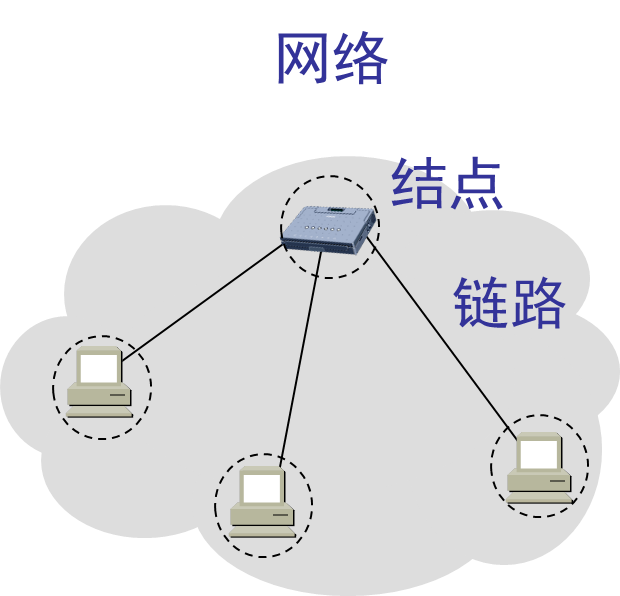

**互联网（internet）**

许多网络连接在一起

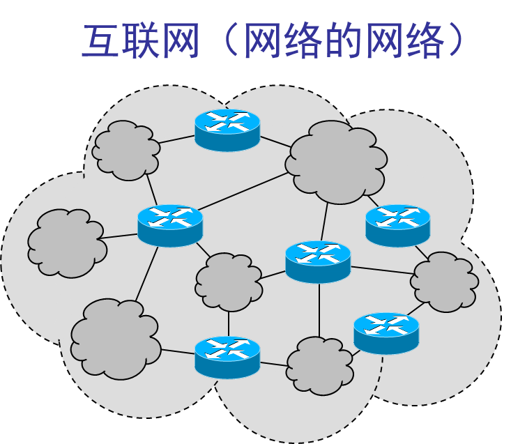

**因特网（Internet）**

全球最大的一个互联网

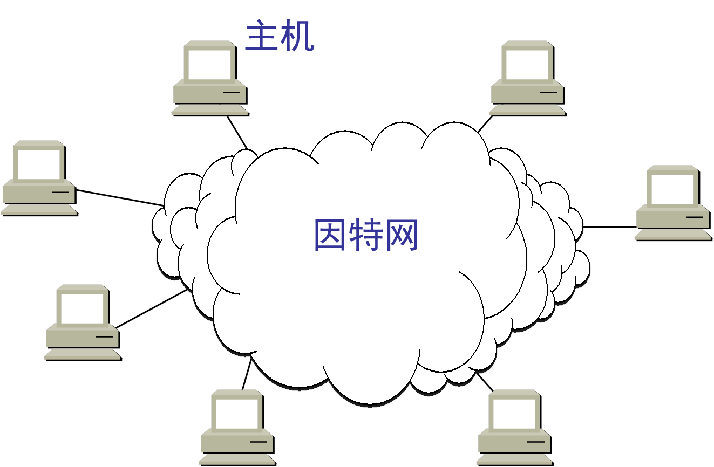

因特网发展的三个阶段

| 上世纪60年代到80年代中期 | 上世纪80年代中期到90年代初 | 90年代初到如今            |
| ------------------------ | -------------------------- | ------------------------- |
| **ARPANET**向互联网发展  | **三级结构**的因特网       | **多层次ISP**结构的因特网 |

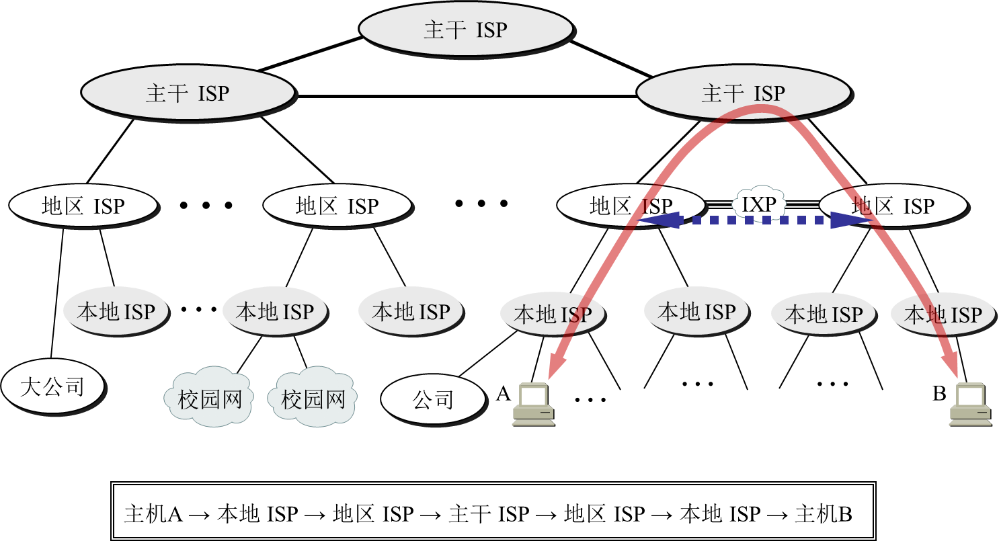

因特网的标准化工作

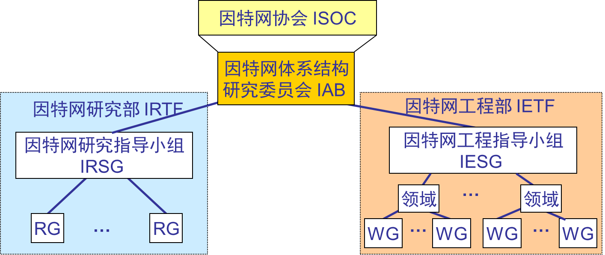

****

## 1.3 因特网的组成

因特网：边缘部分、核心部分。

边缘部分：客户服务器（CS）方式、对等（P2P）方式。

核心部分：电路交换、报文交换、分组交换。

### 1.3.1 边缘部分的通信方式

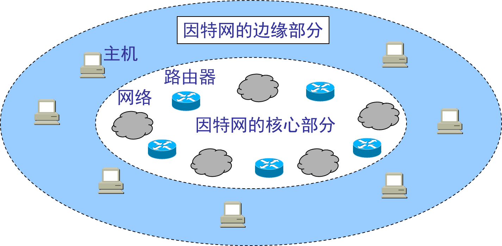

客户服务器方式：

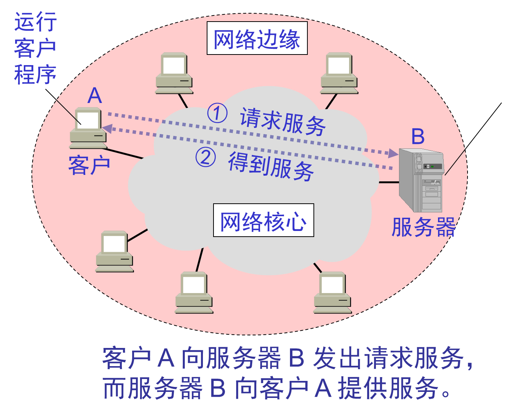

对等方式：

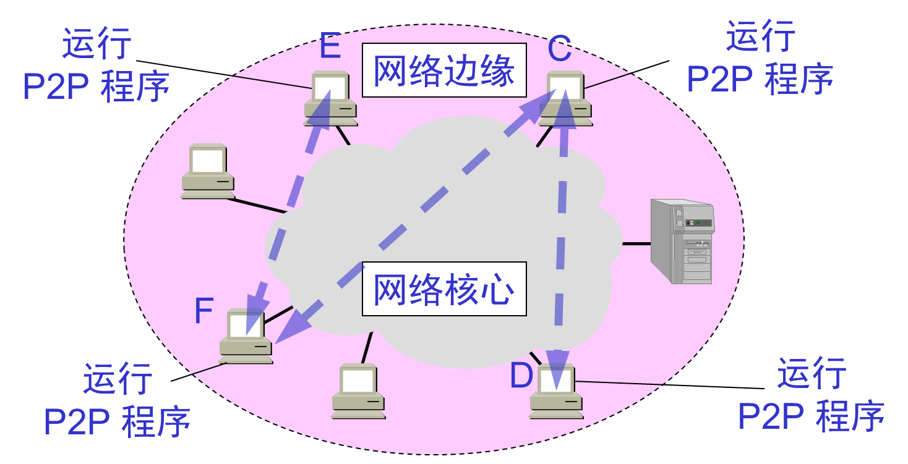

### 1.3.2 核心部分数据交换方式

- 电路交换

  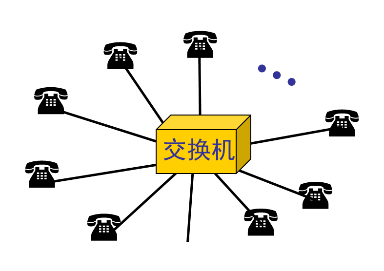

  1. 建立连接
  2. 通话
  3. 释放连接

  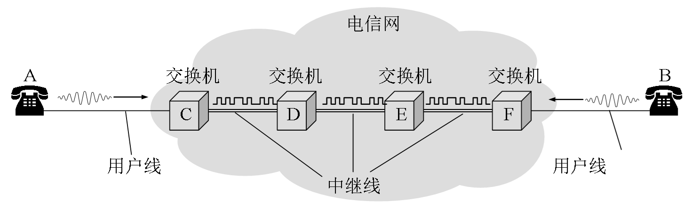

- 报文交换

  采用存储转发直接传输整个报文。

  交换的时延较长。

- 分组交换

  1. 在发送段，先把较长的报文**划分成较短的、固定长度的数据段。**
  2. 每一个数据段前面添加上**首部**构成分组。
  3. 分组交换网以“**分组**”作为数据传输单元。
  4. **依次**把各分组发送到接收端。
  5. 接收端收到分组后**剥去首部**还原成报文。
  6. 最后，在接收端把收到的所有数据**整合**成原来的报文。

  - 优点：高效、灵活、迅速、可靠。
  - 缺点：时延、开销

- 三种转换的比较

  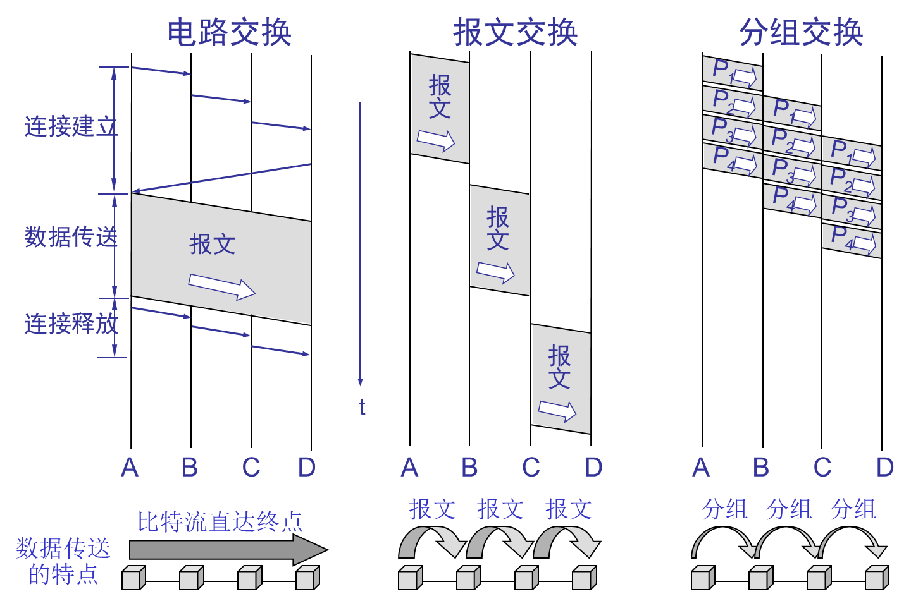

****

## 1.4 计算机网络在我国的发展

- 铁道部在1980年开始进行计算机联网实验。
- 1989年11月我国第一个公用分组交换网 CNPAC 建成运行。
- 中国教育和科研计算机网CERNET（China Education and Research NETwork）简称中国教育网。
- 中国互联网络信息中心 CNNIC（NETwork Information Center of China）

****

## 1.5 计算机网络的分类

- 最简单的定义：一些相互连接的、自治的计算机的集合。

- 几种分类形式：

  | 作用范围      | 使用者 | 拓扑结构 | 交换方式 | 工作方式 |
  | ------------- | ------ | -------- | -------- | -------- |
  | 广域网WAN     | 公用网 | 星型     | 电路交换 | 资源子网 |
  | 城域网MAN     | 专用网 | 环形     | 报文交换 | 通信子网 |
  | 局域网LAN     |        | 网型     | 分组交换 | 接入网   |
  | 个人区域网PAN |        | 总线型   |          |          |
  |               |        | 树型     |          |          |

  