# 第三章 数据链路层

指引

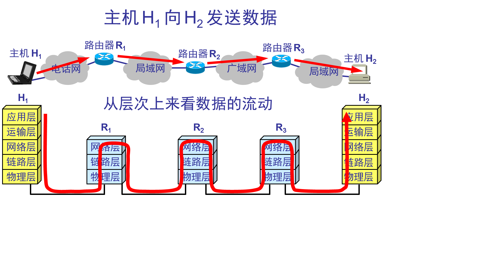

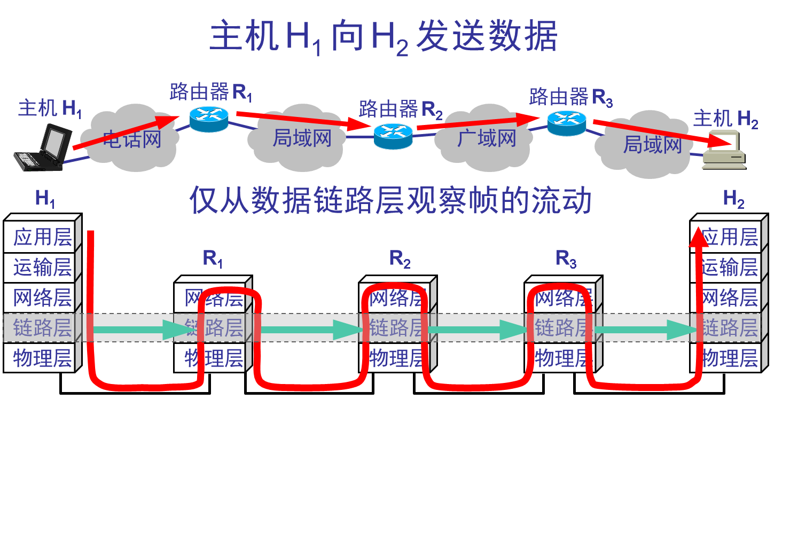

## 3.1 数据链路层基本概念及基本问题

### 3.1.1 基本概念

- **链路（link）**：一条点到点的物理线路段，中间没有任何其他的交换结点。一条链路只是一条通路的一个组成部分。

- **数据链路（data link）**：除了**物理线路**外，还必须有**通信协议**来控制这些数据的传输。若把这些协议的硬件和软件加到链路上，就构成了数据链路。现最常用的方法是使用**网络适配器**（网卡）来实现这些协议的硬件和软件。一般的适配器都包括了**数据链路层**和**物理层**这两层的功能

- **帧（framing）**：数据链路层传送的是帧。

  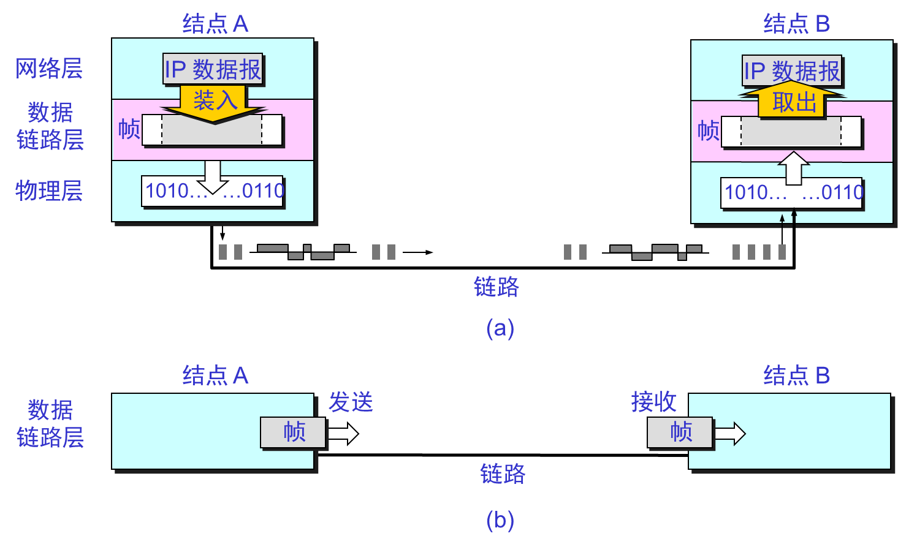

  数据链路层像个数字管道：管道中传输的数据单位是帧

### 3.1.2 三个基本问题

- 封装成帧

  - 封装成帧就是在一段数据的前后分别添加首部和尾部，然后就构成了一个帧。确定帧的界限

  - 首部和尾部的一个重要作用就是进行**帧定界**。

    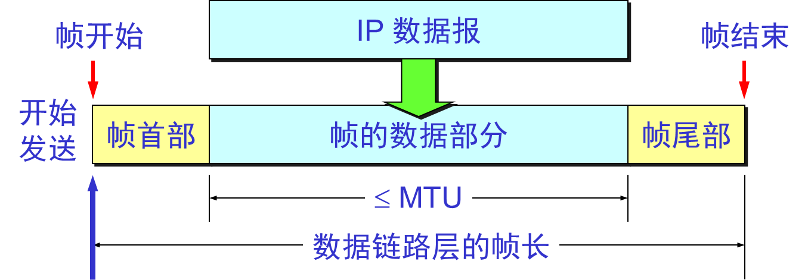

    帧数据部分小于等于1500个字节

    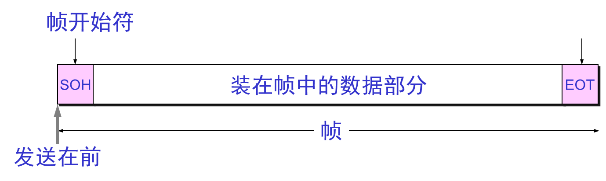

- 透明传输

  - 若传输的数据是ASCII码-中“可打印字符”集时，一般不会有问题。

  - 若传输的数据不是仅由“可打印字符”组成时，就会出问题。

    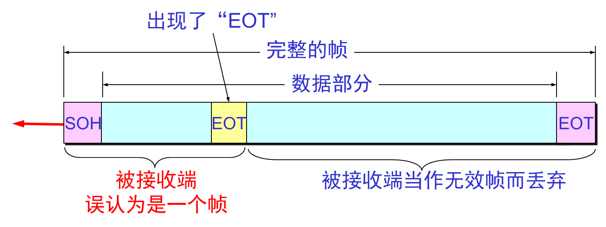

  - 解决方法

    - **字节填充**或**字符填充**——发送端的数据链路层在数据中出现控制字符“SOH”或“EOT”的前面插入一个**转义字符**“ESC”（十六进制编码是1B）。接收端的数据链路层在将数据送往网络层之前删除插入的**转义字符**。

    - 如果转义字符也出现在数据当中，那么在转义字符前面插入一个转义字符。

      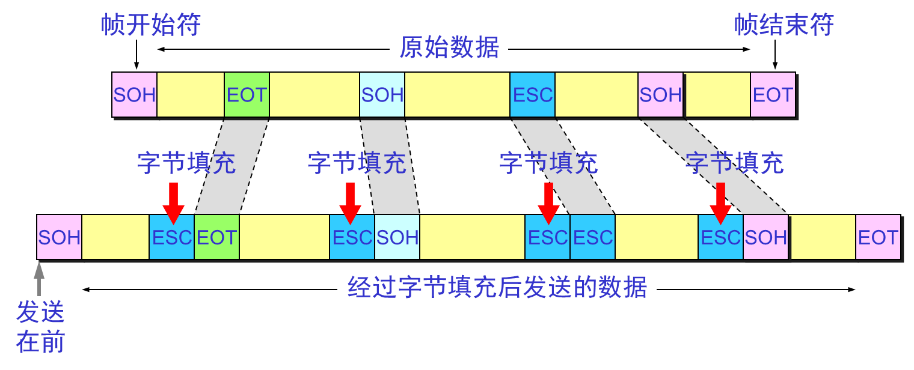

- 差错检测

  - 在传输过程中可能会产生比特差错：1可能变成0,0可能变成1.

  - 在一段时间内，传输错误的比特占所传输比特综述的比率称为**误码率BER（Bit Error Rate）**

  - 误码率与信噪比有很大关系。

  - 为了保证数据传输的可靠性，在计算机网络传输数据时，必须采用各种差错检验措施。

  - **循环冗余检验CRC**

    - 在发送端，先把数据划分为组，假定每组K个比特。

    - 假设待传送的一组数据M = 101001(K = 6)。我们在M的后面再添加供差错检测用的N位冗余码一起发送

    - 用二进制的模2运算进行2^n乘M的运算，这相当于在M的后面添加N个0.

    - 得到（K + N）位的数除以事先选定好的长度为（N + 1）位的除数P，得出商是Q而余数是R，余数R比除数P少1位，即R是N位。

      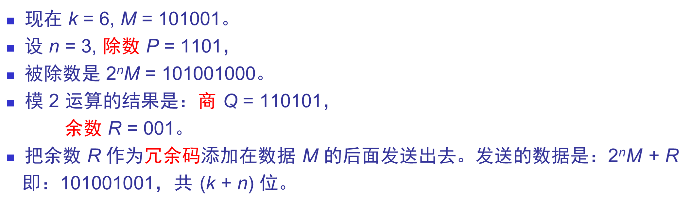

      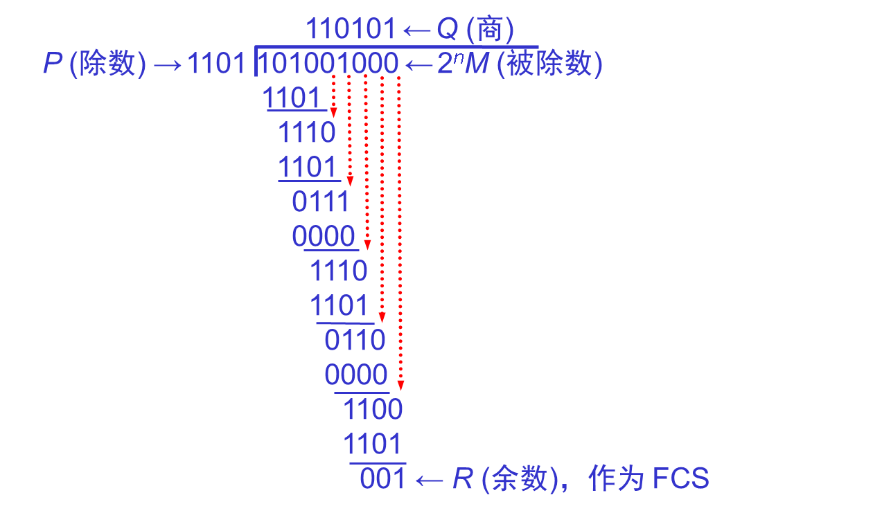

    - 在数据后面添加上的冗余码称为帧检验序列FCS（Frame Check Sequence）

    - 接收端对收到的每一帧进行CRC检验，若余数为0，则接受，为1，测丢弃。

    - CRC和FCS并不等同

      - CRC是一种常用的检错方法，而FCS是添加在数据后面的冗余码
      - FCS可以用CRC的方法得出，但CRC并非用来获得FCS的唯一方法。

    - 使用CRC只能做到**无差错接受**，要做到“**可靠传输**”就必须再加上**确认**和**重传**机制（考虑：帧重复、丢失、乱序的情况）。可以说“CRC是一种**无比特差错**，而不是一种**无传输差错**的检测机制”

## 3.2. 使用点对点信道的数据链路层

**点对点协议PPP（Point-to-Point protocol）**：这种信道使用一对一的点对点通信方式

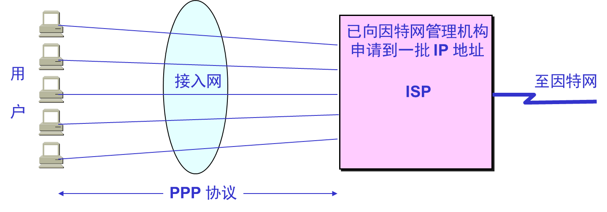

**PPP协议应满足的需求：**

- 简单
- 封装成帧
- 透明性
- 多种网络层协议
- 多种类型链路
- 差错检测
- 检测连接状态
- 最大传送单元
- 网络层地址协商
- 数据压缩协商

**PPP协议的组成部分：**

- 一个将IP数据报封装到串行链路的方法。PPP既支持异步链路（无奇偶检验的比特数据）， 也支持面向比特的同步链路。
- 链路控制协议LCP(Link Control Protocol)
- 网络控制协议NCP(Network Control Protocol)

**PPP协议的帧格式：**

- **标志字段F = 0X7E （01111110）**

- 地址字段A = 0XFF 。地址字段实际上并不起作用。

- 控制字段C = 0X03

- PPP是面向字节的，所有的PPP帧长度都是整数字节

  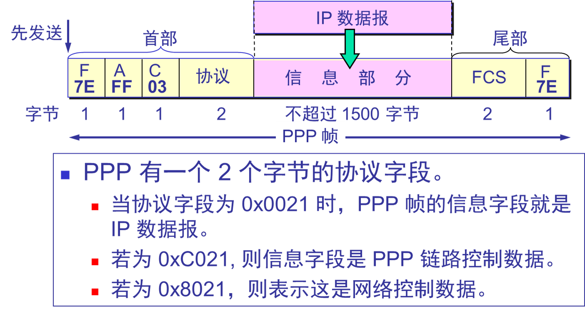

**PPP协议的透明传输：**

- 当PPP用在同步传输链路时，协议规定采用硬件来完成比特填充。**零比特填充**。

- 当PPP用在异步传输时，就使用一种特殊的**字符填充法**。

- **字符填充**

  - 将信息字段中出现的每一个0X7E字节转变成为2字节序列（0X7D，0X5E）
  - 若信息字段中出现一个0X7D的字节，则将其转变成为2字节序列（0X7D,0X5D）
  - 若信息字段中出现ASCII码的控制字符（即数值小于0X2D的字符），则在该字符前面要加入一个0X7D字节，同时将该字符的编码加以改变。

- **零比特填充**

  - PPP协议用在SONET/SDH链路时，是使用同步传输，这时候PPP协议采用零比特填充方法来实现透明传输。

  - 在发送端，只要发现有5个连续1，则立即填入一个0.接收端对帧中的比特流进行扫描。每当发现5个连续的1，则删除后面的一个0.（**注：标志字段F = 0X7E （01111110）**）

    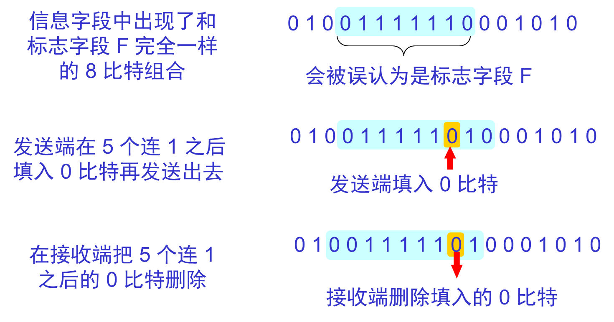

- **PPP协议的工作状态**

  - 当用户拨号接入ISP时，路由器的调制解调器对拨号做出确认，并建立一条物理连接。

  - PC机向路由器发送一系列的**LCP分组**（封装成多个PPP帧）。

  - 这些分组及其响应选择一些PPP参数，和进行网络层配置，**NCP**给新接入的PC机分配一个临时的IP地址，使PC机成为因特网上的一个主机。

  - 通信完毕时，NCP释放网络层连接，收回原来分配出去的IP地址。接着，LCP释放数据链路层连接。最后释放物理层连接。

    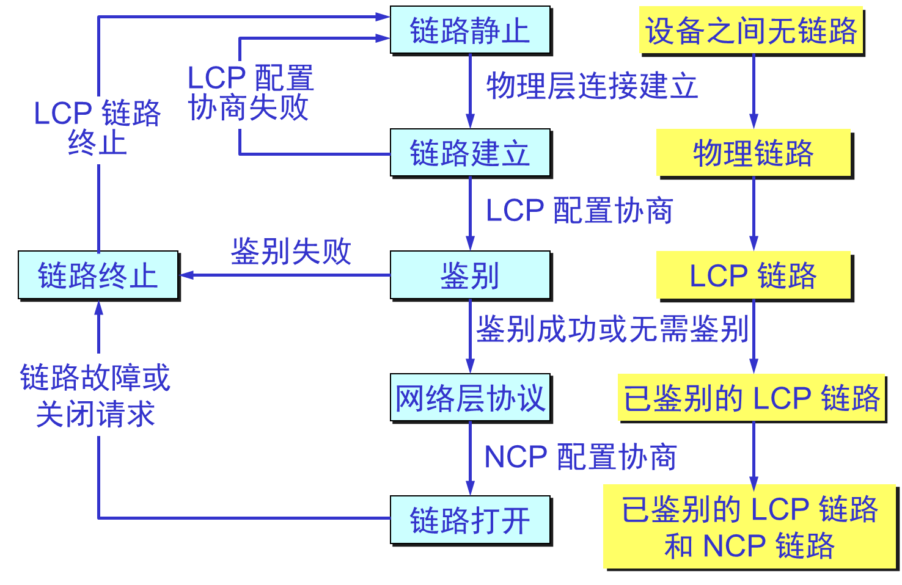

## 3.3 使用广播信道的数据链路层

​	这种信道使用一对多的广播通信方式，因此过程比较复杂。广播信道上连接的主机很多，因此必须使用专用的共享信道协议来协调这些主机的数据发送。

​	局域网的只要特点：网络为一个单位所拥有，且地理范围和站点数目均有限。

​	局域网具有如下的一些主要优点：

- 具有广播功能，从一个站点可以很方便地访问全网。局域网上的主机可共享连接在局域网上的各种硬件和软件资源。

- 便于系统的扩展和逐渐地演变，各设备的位置可灵活调整和改变。

- 提高了系统的可靠性、可用性和残存性。

  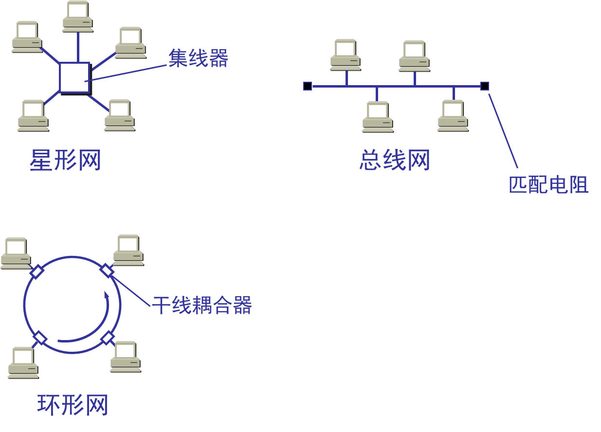

媒体共享技术：

- 静态划分信道
  - 频分复用
  - 时分复用
  - 波分复用
  - 码分复用
- 动态媒体接入控制（多点接入）
  - 随机接入
  - 受控接入，如多点线路探询（polling），或轮询。

802委员会划分的数据链路层的两个子层：

- 逻辑链路控制LLC（Logical Link Control）子层
- **媒体接入控制MAC（Medium Access Control）子层**

适配器：

- 网络接口板又称为**通信适配器**（adapter）或**网络接口卡**NIC（Network Interface Card），或**网卡**。

- 适配器的重要功能

  - 进行串行/并行转换；
  - 对数据进行缓存；
  - 在计算机的操作系统安装设备驱动程序；
  - 实现以太网协议。

  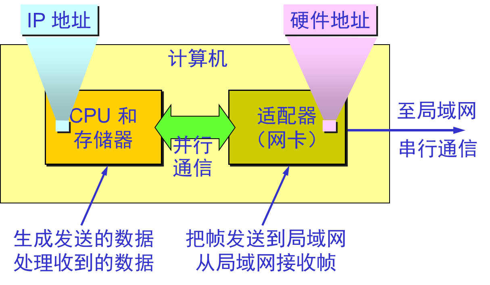

CSMA/CD协议

- 最初的以太网是将许多计算机都连接到一根总线上。

  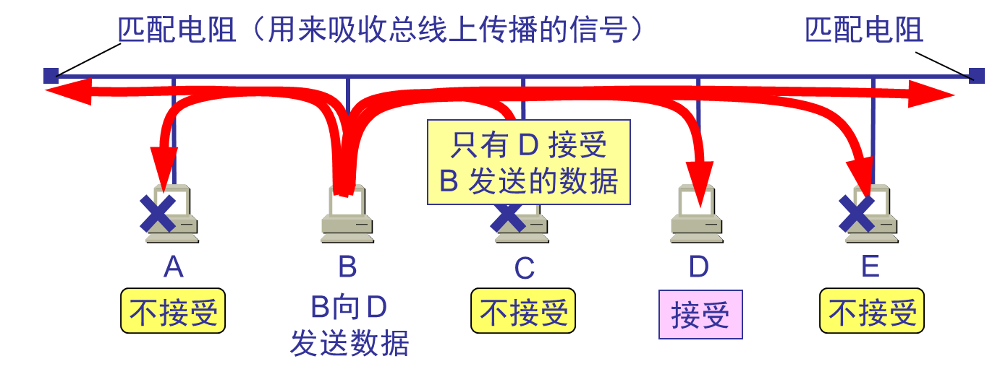

  总线上的每一个工作的计算机都能检测到B发送的数据信号。由于只有计算机D的地址与数据帧首部写入的地址一致，因此只有D才**接受**这个数据帧。其他所有的计算机（A、C和E）都检测到不是发送给他们的数据帧，故**丢弃**。具有广播特性的总线上实现了一对一的通信。

- 为了通信的简便以太网采用了两种重要的措施

  - 采用较为灵活的无连接的工作方式，即不必先建立连接就可以直接发送数据；
  - 以太网对发送的数据帧不进行编号，也不要求对方发回确认。

- 以太网提供的服务

  - 不可靠交付，即尽最大努力的交付
  - 收到差错数据帧时丢弃
  - 以太网不需要知道传输的数据帧是否是重传的数据帧

- 曼彻斯特编码

  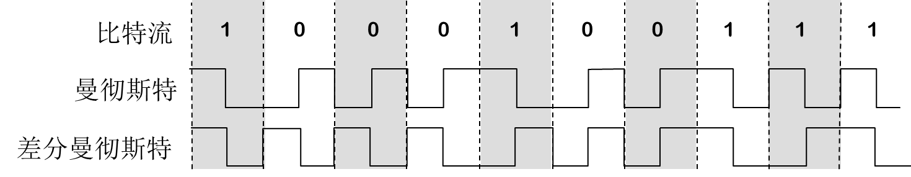

- 载波监听多点接入/碰撞检测（CSMA/CD Carrier Sense Multiple Access with Collision Detection）

  - **多点接入**：表示许多计算机以多点接入的方式连接在一根总线上。

  - **载波监听**：是指每一个站在发送数据之前先要检测一下总线上是否有其他计算机在发送数据，如果有，则暂时不发。

  - **碰撞检测**：就是计算机边发送数据边检测信道上的信号电压大小。

    - 当几个站同时在总线上发送数据时，总线上的信号电压摆动值将会增大。
    - 当一个站检测到的信号电压摆动值超过一定的门限值时，就认为总线上至少有两个站在发送数据，表明产生了碰撞。
    - 碰撞也叫做冲突。

    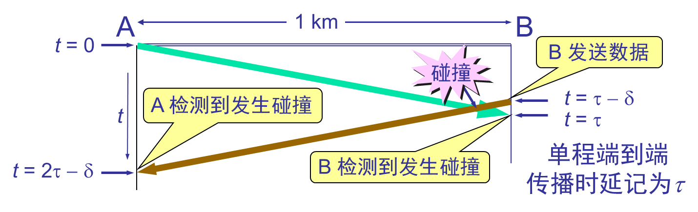

    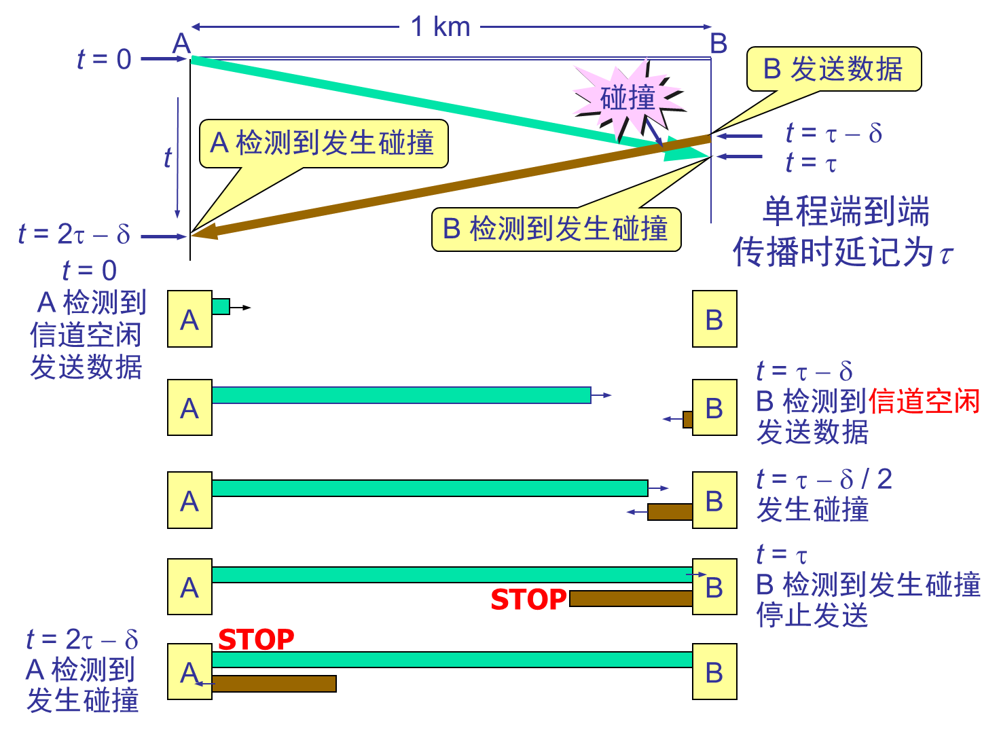

- 重要特性

  - 使用CSMA/CD协议的以太网不能进行全双工通信而只能进行双向交替通信（半双工通信）
  - 每个站在发送数据之后的一小段时间内，存在着遭遇碰撞的可能性。
  - 这种**发送的不确定性**使整个以太网的平均通信量远小于以太网的最高数据率。

- 争用期

  - 最先发送数据帧的站，在发送数据帧后至多经过时间2t（两倍的端到端往返时延）就可知道发送的数据帧是否遭受了碰撞。
  - 以太网的端到端往返时延2t称为**争用期**，或**碰撞窗口**。 
  - 经过争用期这段时间还没检测到碰撞，才能肯定这次发送不会发生碰撞。

- 二进制指数类型退避算法

  - 发生碰撞的站在停止发送数据后，要推迟一个随机时间才能再发送数据
    - **基本退避时间**取为争用期2t；
    - 从整数集合[0,1,...,(2^k-1)]中随机地抽取一个数，记为r。重传所需的时延就是r倍的**基本退避时间**，即2rt。
    - 参数k的计算公式： k = Min[重传次数, 10]
    - 当重传达16次仍不能成功时即丢弃该帧，并向高层报告。

- 争用期的长度

  - 以太网取51.2μs为争用期长度。
  - 对于10Mb/s以太网，在争用期可发送512bit，即64字节
  - 以太网在发送数据时，若前64字节没有发生冲突，则后续的数据就不会发生冲突。

- 最短有效帧长

  - 如果发生冲突，就一定是在发送的前64字节内
  - 由于一检测到冲突就立即终止发送，这时已经发送出去的数据一定小于64字节
  - 以太网规定了最短有效帧长为64字节，凡小于64字节的帧都是由于冲突而异常中止的无效帧。

- 强化碰撞

  - 当发送数据的站一旦发现发生了碰撞时

    - 立即停止发送数据；

    - 再继续发送若干比特的**人为干扰信号**，以便让所有用户都知道现在已经发生了碰撞。

      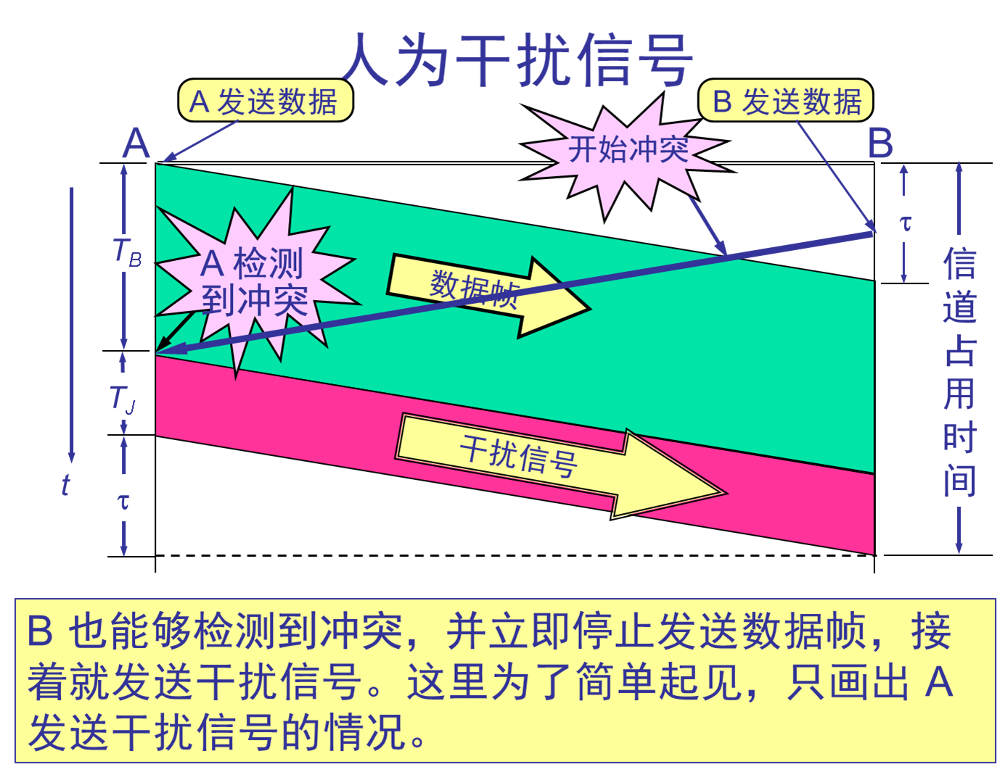

## 3.4 使用广播信道的以太局域网

以太网：粗同轴电缆 -> 细同轴电缆 ->**双绞线**

使用双绞线的以太网一般采用星型拓扑，在星型的中心增加了一种可靠性非常高的设备，叫做**集线器（hub）**（目前很少见了）。

集线器特点：

- 使用电子器件来模拟实际电缆线的工作
- 使用集线器的以太网逻辑上仍是一个总线网，使用CSMA/CD协议
- 集线器很像一个多接口的转发器，工作在物理层。

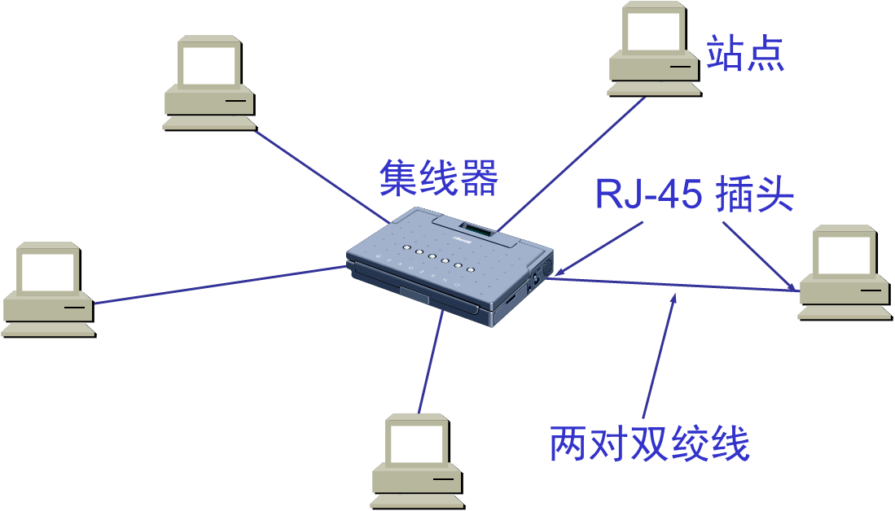

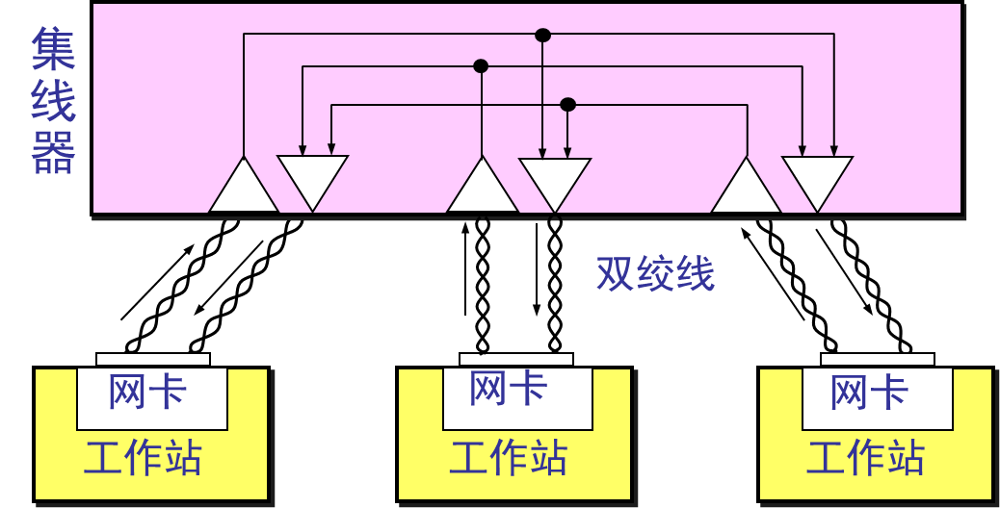

以太网的信道利用率：

- 以太网的信道被占用的情况；

- 争用期长度为2t，即端到端传播时延的两倍。检测到碰撞后不发送干扰信号。

- 帧长为L（bit），数据发送速率为C（b/s），因而帧的发送时间为L/C = T0(s)。

- 一个帧从开始发送，经可能发生的碰撞后，将再重传数次，到发送成功且信道转为空闲（即再经过时间t使得信道上无信号在传播）时为止，是发送一帧所需的平均时间

  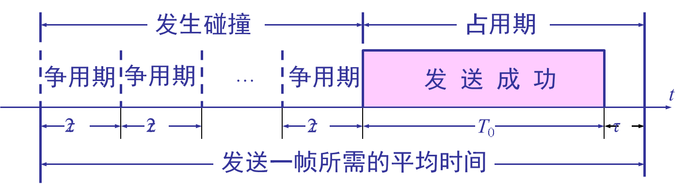

- 参数a

  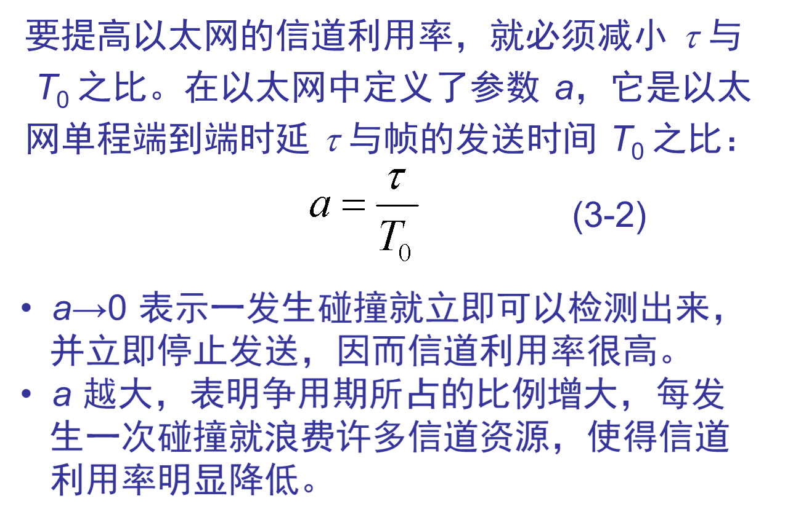

  当数据率一定时，以太网的连线长度收到限制，否则t的数值会太大。

  以太网的帧长不能太短，否则T0的值会太小，使a值太大。

- 信道利用率的最大值 S max

  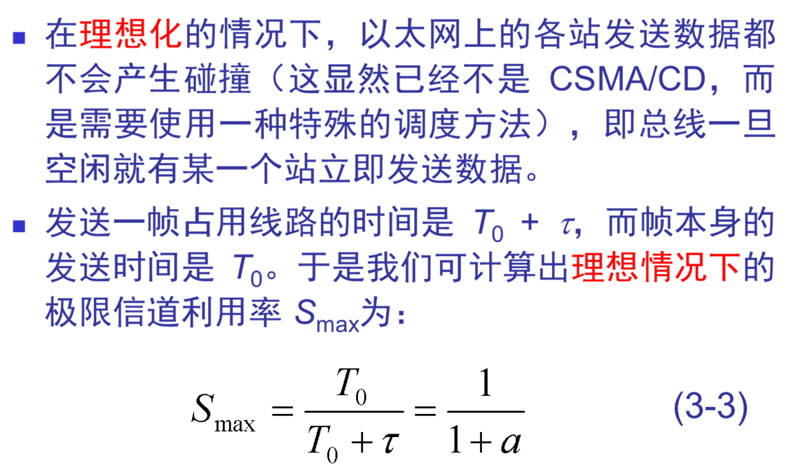

- 以太网的MAC层

  - 在局域网中，**硬件地址**又称**物理地址**，或**MAC地址**。
  - 802标准所说的”地址“严格地讲应当是每一个站的”**名字**“或**标识符**。

- 适配器检查MAC地址

  - 适配器从网络上每收到一个MAC帧就首先用硬件检查MAC帧中的MAC地址。

    - 如果是发往本站的帧则收下，然后再处理
    - 否则就将此帧丢弃，不再处理。

  - ”**发往本站的帧**“一般包括三种：

    - 单播（unicast）帧（一对一）
    - 广播（broadcast）帧（一对全体）
    - 多播（multicast）帧（一对多）

  - MAC帧格式

    - 常用DIX Ethernet V2标准

    - 以太网的MAC帧格式

      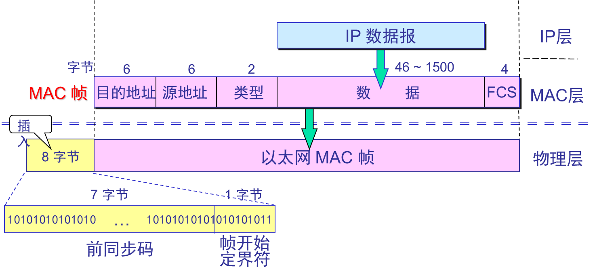

  - 无效的MAC帧

    - 数据字段的长度与长度字段的值不一致；
    - 帧的长度不是整数个字节；
    - 用收到的帧检验序列FCS查出有差错；
    - 数据字段的长度不再46-1500字节之间；
    - 有效的MAC帧长度不在64-1518字节之间；
    - 对于检查出的无效MAC帧就简单地丢弃，以太网不负责重传。

  - 帧间最小间隔

    - 帧间最小间隔为9.6μs，相当于96bit的发送时间
    - 一个站在检测到总线开始空闲后，还要等待9.6μs才能再次发送数据；

## 3.4 扩展局域网

### 3.4.1 在物理层扩展局域网

- 主机使用光纤和一对光纤调制解调器连接到集线器

  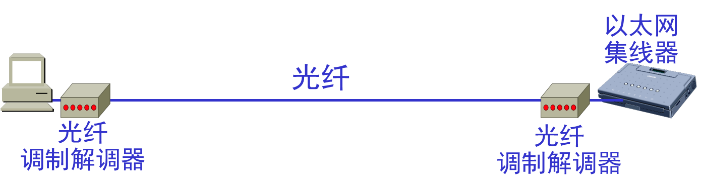

- 用多个集线器可连成更大的局域网

  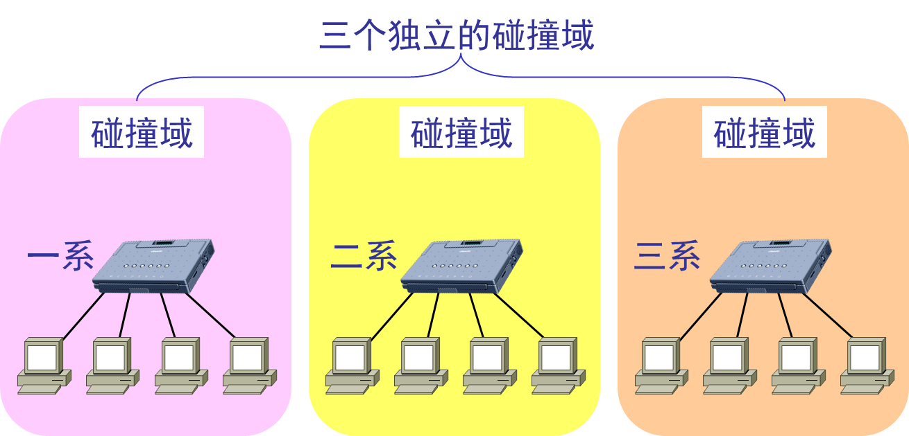

- 更大的局域网

  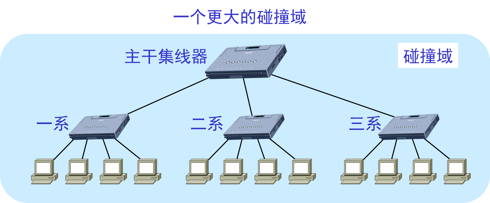

  优点：

  - 使原来属于不同碰撞域的局域网上的计算机能够进行跨碰撞域的通信。
  - 扩大了局域网覆盖的地理范围。

  缺点：

  - 碰撞域增大了，但总的吞吐量并未提高；
  - 如果不同的碰撞域使用不同的数据率，那么就不能用集线器将它们互连起来。

### 3.4.2 在数据链路层扩展局域网

- 在数据链路层扩展局域网是使用网桥。

- 网桥工作在数据链路层，它根据MAC帧的目的地址对收到的帧进行转发。

- 网桥具有过滤帧的功能。当网桥收到一个帧时，并不是向所有的接口转发此帧，而是先检查此帧的目的MAC地址，然后再确定将该帧转发到哪一个接口。

  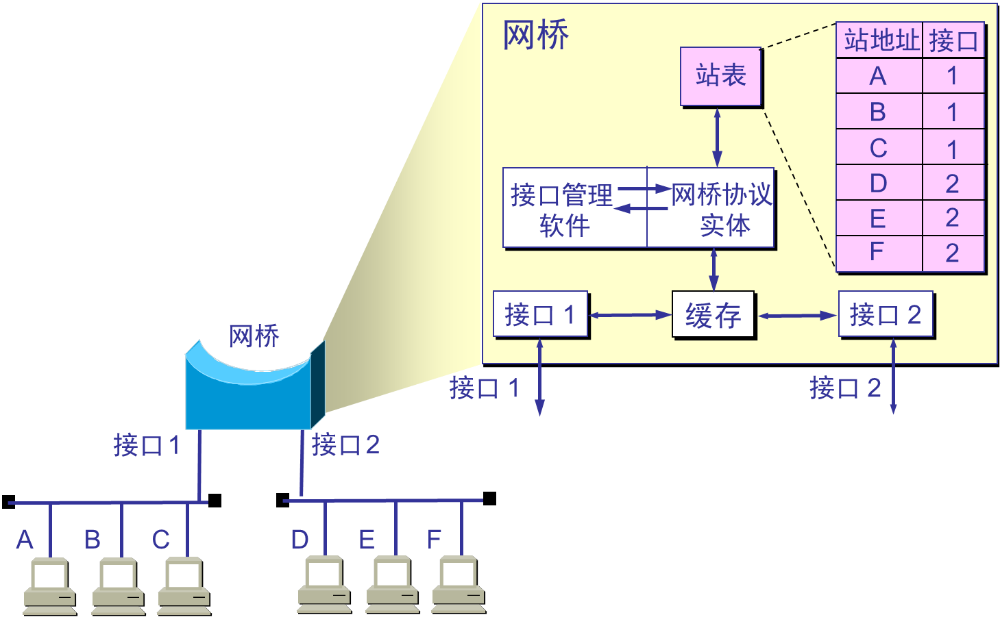

- 优点：

  - 过滤通信量

  - 扩大了物理范围

  - 提高了可靠性

  - 可互连不同物理层、不同MAC子层和不同速率的局域网

    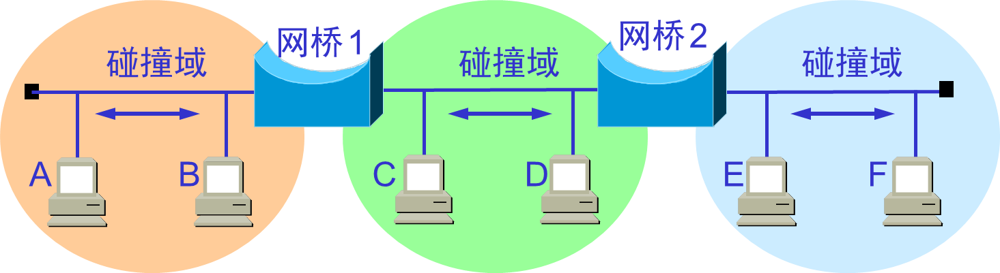

- 缺点：

  - 存储转发增加了时延

  - 在MAC子层并没有流量控制功能

  - 具有不同MAC子层的网段桥接在一起时时延更大

  - 网桥只适合于用户数不太多和通信量不太大的局域网，否则有时还会因传播过多的广播信息而产生网络拥塞。**广播风暴**。

    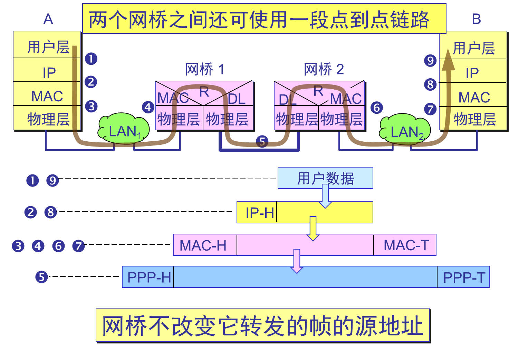

- 网桥与集线器差别

  - 集线器在转发帧时，不对传输媒体进行检测
  - 网桥在转发帧之前必须执行CSMA/CD

- 透明网桥

  - 目前使用的最多的网桥是**透明网桥**（transparent bridge）
  - ”透明“是指局域网上的站点并不知道所发送的帧将经过哪几个网桥。
  - 透明网桥是一种**即插即用设备**，其标准是IEEE802.1D。

- 网桥自学习算法

  - 若从A发出的帧从接口X进入了某网桥，那么从这个接口触发沿相反方向一定可把一个帧传送到A；

  - 网桥没收到一个帧，就记下其源地址和进入网桥的接口，作为转发表中的一个项目；

  - 在建立转发表时是把帧首部中的源地址写在”地址“这一栏下面；

  - 在转发帧时，则是根据收到的帧首部中的目的地址来转发的。这时就把在”地址“栏下面已经记下的源地址当作目的地址，而把记下的进入接口当作转发接口。

    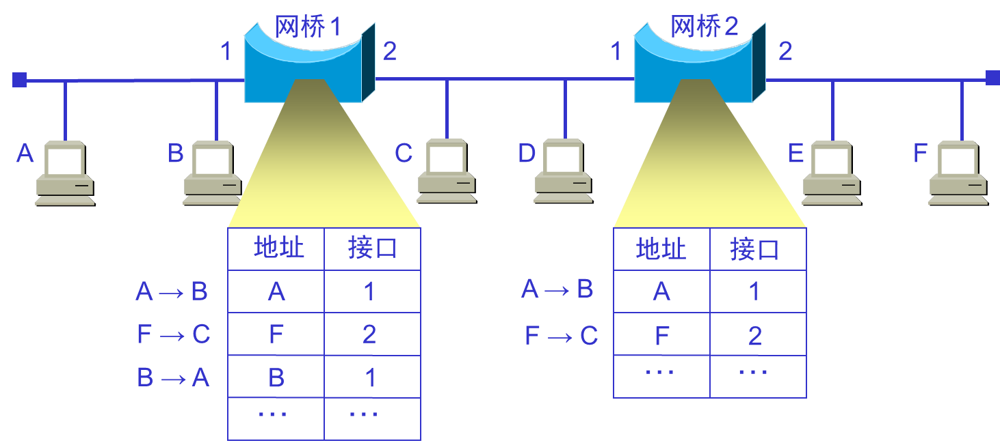

- 生成树

  - 互连在一起的网桥在进行彼此通信后，就能找出原来的网络拓扑的一个子集。在这个子集里，整个连通的网络中不存在回路，即**在任何两个站之间只有一条路径**。
  - 为了避免产生转发帧在网络中不断兜圈子
  - 为了得出能够反映网络拓扑发生变化时的生成树，在生成树上的根网桥每隔一段时间还要对生成树的拓扑进行更新。

- 多接口网桥——交换机

  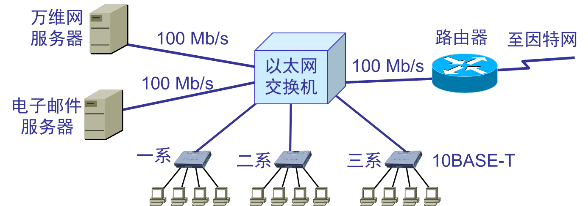

- 虚拟局域网（VLAN）

  - 虚拟局域网VLAN是由一些局域网网段构成的与物理位置无关的逻辑组

    - 这些网段具有某些共同的需求
    - 每一个VLAN的帧都由一个明确的标识符，指明发送这个帧的工作站是属于哪一个VLAN。

  - 虚拟局域网其实只是局域网给用户提供的一种服务

    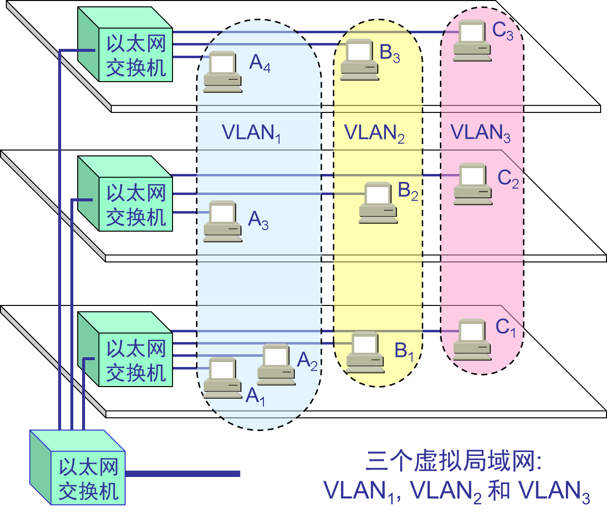

  - 虚拟局域网使用的以太网帧格式

    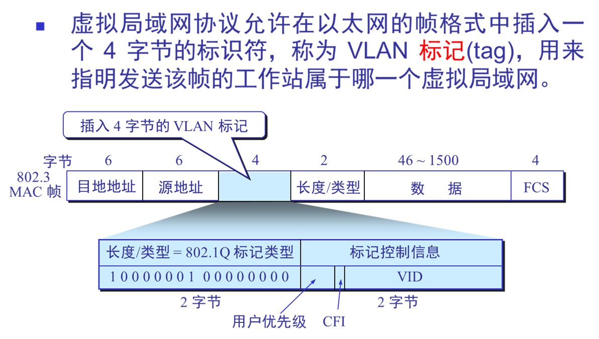

    

## 3.5 高速以太网

- 速率达到或超过100Mb/s的以太网称为**高速以太网**。
- 在双绞线上传送100Mb/s基带信号的星型拓扑以太网，仍使用IEEE 802.3的CSMA/CD协议。100BASE-T以太网又称为**快速以太网**（Fast Ethernet）