# 第二章 物理层

## 2.1  物理层的基本概念

​	物理层解决如何在连接各种计算机的**传输媒体**上**传输数据比特流**，而不是指具体的传输媒体。

​	物理层的主要任务描述为：确定与传输媒体的接口的一些特性，即：

- 机械特性：接口形状，大小，引线数目
- 电气特性：规定电压范围（-5V到+5V）
- 功能特性：例规定-5V表示0，+5V表示1
- 过程特性：也称规程特性，规定建立连接时各个相关部件的工作步骤

****

## 2.2 数据通信的基础知识

### 2.2.1数据通信系统的模型

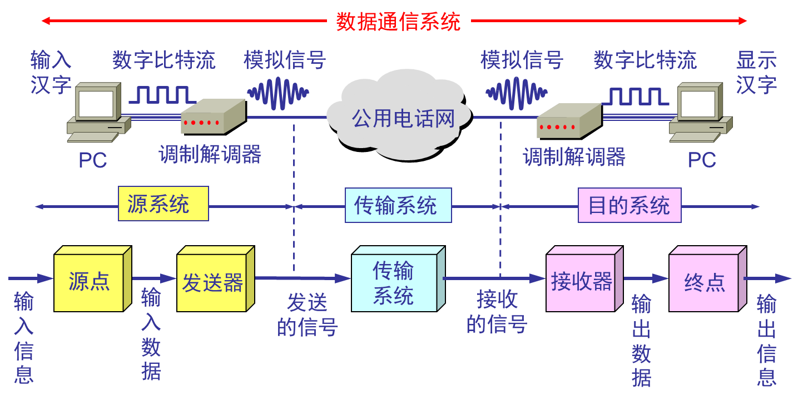

- 相关术语

  通信的目的是**传送消息**。

  数据（data）——运送消息的实体。

  信号（signal）——数据的电气的或电磁的表现。

  “模拟的”（analogous）——代表消息的参数的取值是连续的。

  “数字的”（digital）——代表消息的参数的取值是离散的。

  码元（code）——在使用时间域（或简称为时域）的波形表示数字信号时，代表不同离散数值的基本波形。

### 2.2.2 有关信号的几个基本概念

信道一般表示向一个方向传送信息的媒体。

单向通信（**单工通信**）——只能有一个方向的通信而没有反方向的交互。

双向交替通信（**半双工通信**）——通信的双方都可以发送信息，但不能双发同时发送（接收）。

双向同时通信（**全双工通信**）——通信的双方可以同时发送和接收消息。

**基带信号**（即基本频带信号）——来自信源的信号。

**带通信号**——把基带信号经过载波**调制**后，把信号的频率范围搬移到较高的频段以便在信道中传输。

最基本的二元制调制方法：

1. **调幅（AM）**：载波的振幅随基带数字信号而变化。
2. **调频（FM）**：载波的频率随基带数字信号二变化。
3. **调相（PM）**：载波的初始相位随基带数字信号而变化。

### 2.2.3 常用编码

- 单极性不归零码

  只使用一个电压值，用高电平表示1，无电压表示0.

- 双极性不归零码

  用正电平和负电平分别表示二进制数据的1和0，正负幅值相等。

- 双极性归零码

  正负零三个电平，信号本身携带同步信息。

- 曼彻斯特编码

- 差分曼彻斯特编码

### 2.2.4 信道的极限容量

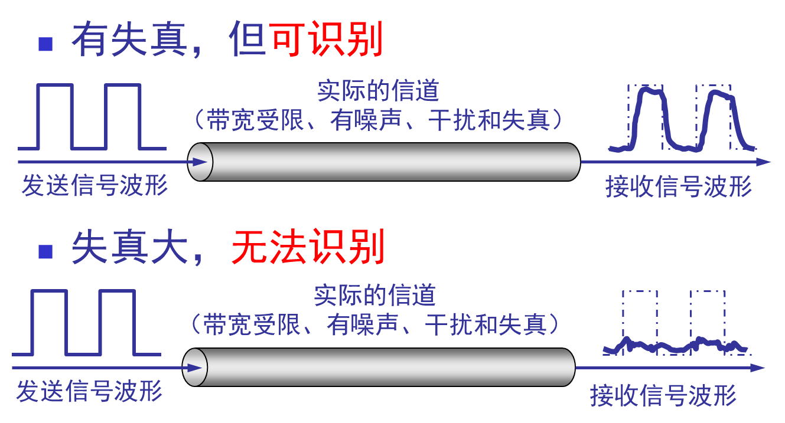

**奈氏准则**（影响码元传输速率）

奈奎斯特给出在假定的理想条件下，为了避免**码间串扰**，码元的传输速率的上限值。如果信道的频带越宽，也就是能够通过的信号高频分量越多，那么就可以用更高的速率传送码元而不出现码间串扰。

理想低通信道的最高码元传输速率 = 2WBaud

- W是理想低通信道的带宽，单位为HZ。
- Baud是波特，是码元传输速率的单位。

**香农公式**（影响信息传输速率）

香农用信息论的理论推导了带宽受限且有高斯白噪声干扰的**信道极限**、**无差错的**信息传输速率。

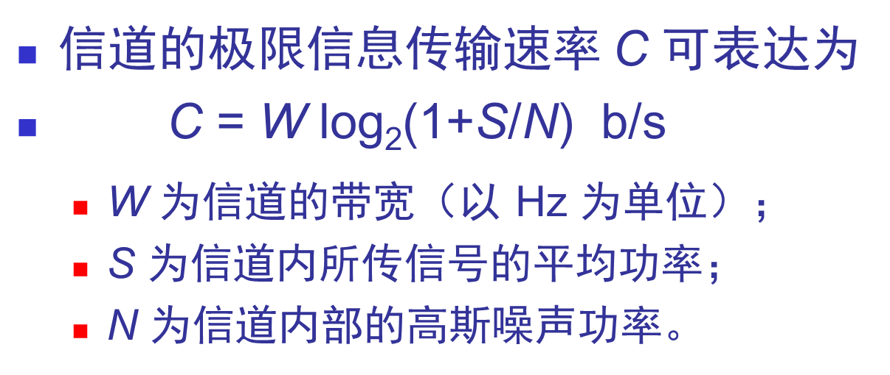

## 2.3 物理层下面的传输媒体

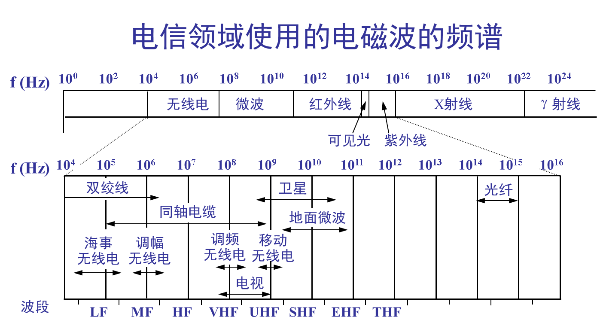

### 2.3.1 导引型传输媒体

- 双绞线

  - 屏蔽双绞线STP（Shielded Twisted Pair）
  - 无屏蔽双绞线UTP（Unshielded Twisted Pair）

- 同轴电缆

  - 50Ω同轴电缆（数字传输）
  - 75Ω同轴电缆（模拟传输）

- 光缆

  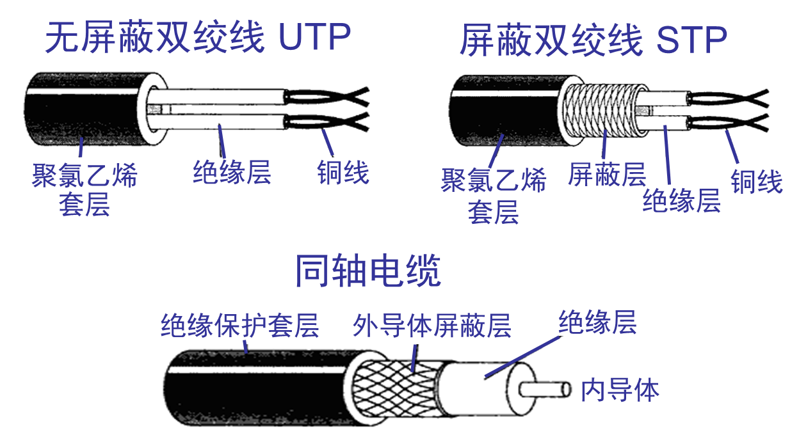

### 2.3.2 非导向传输媒体

无线传输所用的频段很广。

短波通信主要是靠电离层的反射，但质量差。

微波在空间主要是直线传播

- 地面微波接力通信
- 卫星通信

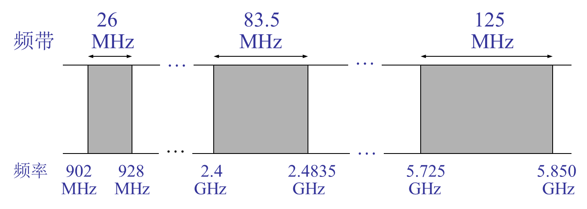

## 2.4 信道复用技术

### 2.4.1 频分复用、时分复用和统计时分复用

- 频分复用 FDM（Frequency Division Multiplexing）

  用户在分配到一定的频带后，在通信过程中自始自终都占用这个频带。

  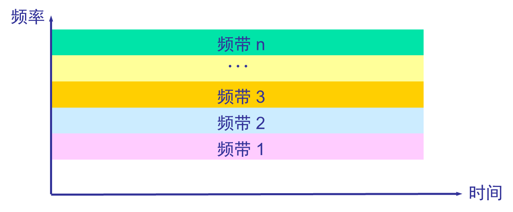

- 时分复用 TDM （Time Division Multiplexing）

  时分复用则是将时间划分为一段段等长的时分复用帧。每一个时分复用的用户在每一个TDM帧中占用固定序号的时隙。

  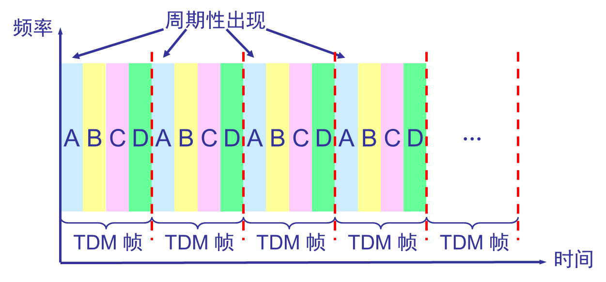

  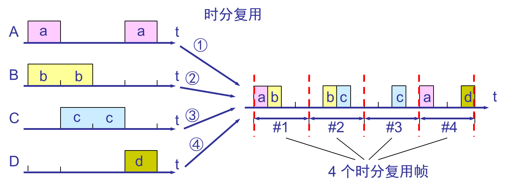

- 统计时分复用 STDM （Static TDM）

  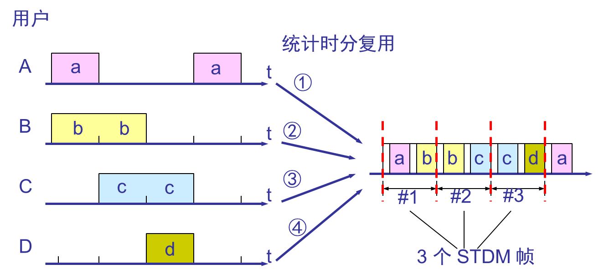

### 2.4.2 波分复用WDM (Wavelength Division Multiplexing)

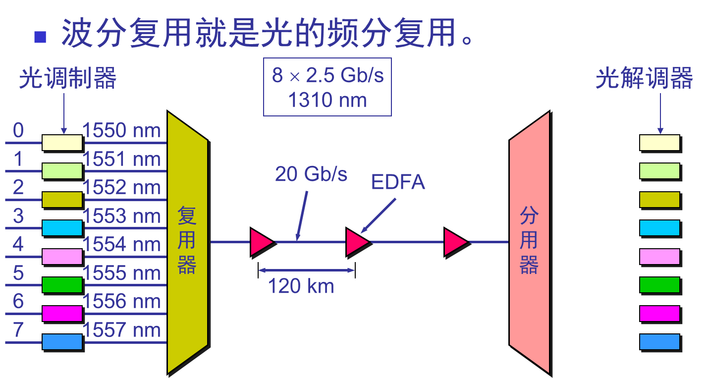

### 2.4.3 码分复用CDM （Code Division Multiplexing）

- 常用的名词是**码分多址** CDMA（Code Division Multiple Access）
- 每一个比特时间划分为m个短的间隔，称为码片（chip）。
- 码片序列（chip sequence）
  - 每个站被指派一个唯一的m bit码片序列。
    - 如发送比特1，则发送自己的m bit 码片序列
    - 如发送比特0，则发送该码片序列的二进制反码。
  - 表示的时候比特0用-1代替。
  - 每个站分配的码片序列不仅必须各不相同，并且还必须相互**正交**。
  - 在实用的系统中是使用伪随机码序列。

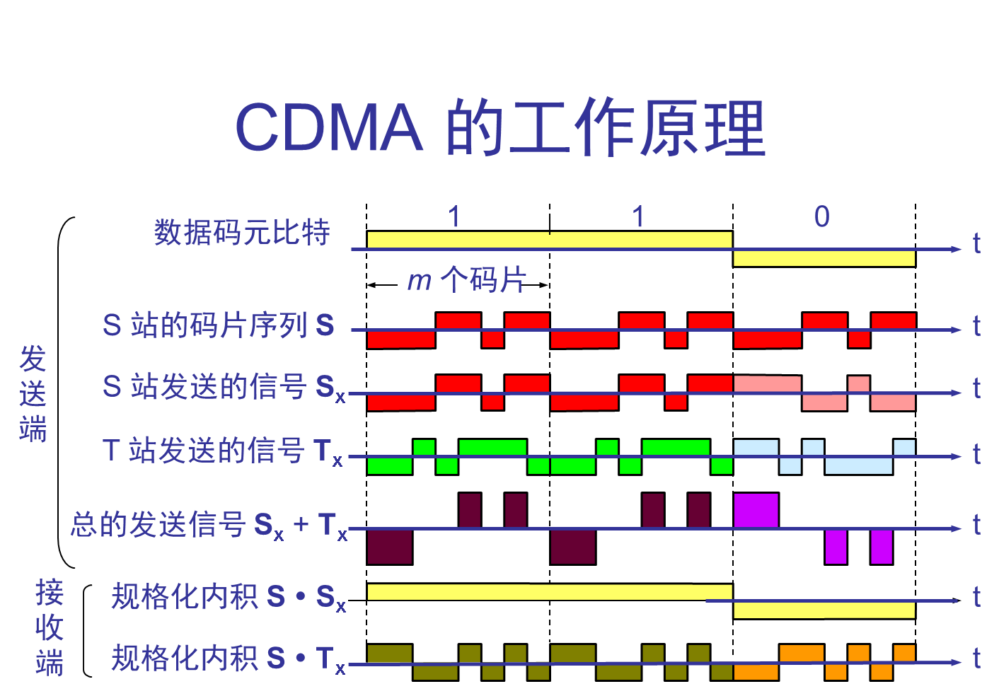

## 2.5 数字传输系统

脉码 调制PCM体制最初是为了在电话局之间的中继线上传送多路的电话。

由于历史上的原因，PCM有两个互不兼容的国际标准：

- 北美的24路PCM（T1）1.544Mb/s
- 欧洲的30路PCM（E1）2.048Mb/s 我国也采用

## 2.6 带宽接入技术

### 2.6.1 ADSL技术

ADSL技术就是用数字技术对现有的模拟电话用户线进行改造，使它能够承载宽带业务。

- ADSL（Asymmetric Digital Subscriber Line）:非对称数字用户线
- HDSL（High speed DSL）：高速数字用户线
- SDSL（Single-line DSL）：1对线的数字用户线
- VDSL（Very high speed DSL）：甚高速数字用户线
- DSL：ISDN用户线
- RADSL（Rate-Adaptive DSL）：速率自适应DSL，是ADSL的一个子类，可自动调节线路速率

ADSL的特点：

- 上行和下行带宽不对称

- 我国目前采用的方案是离散多音调DMT（Discrete Multi-Tone）调制技术。

  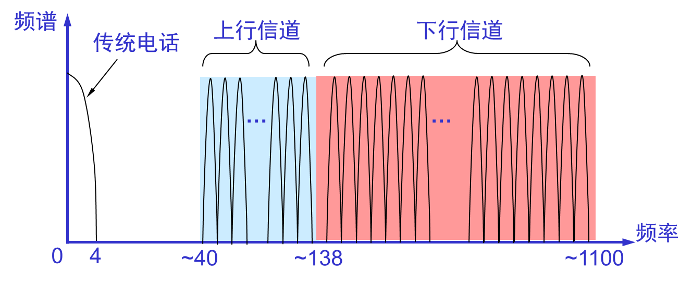

ADSL的组成：

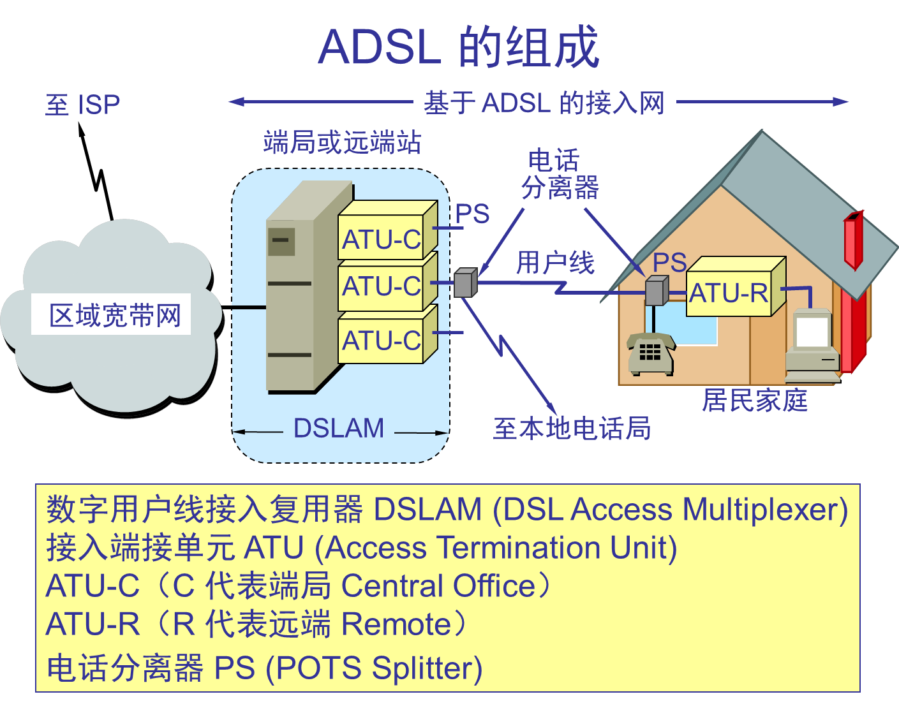

### 2.6.2 光纤同轴混合网HFC（Hybrid Fiber Coax）

- HFC网是在目前覆盖面很广的有线电视网CATV的基础上开发的一种居民宽带接入网。

- 特点：

  - HFC网的主干线路采用光纤

  - HFC网采用结点体系结构

    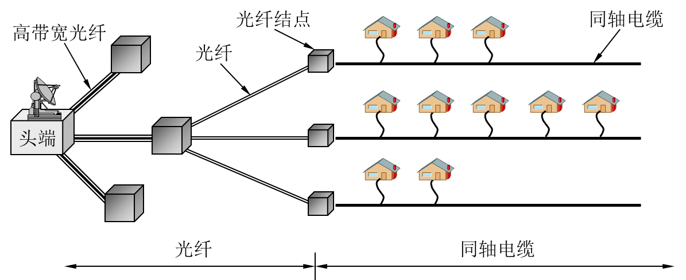

  - HFC网具有比CATV网更宽的频谱，且具有双向传输功能

    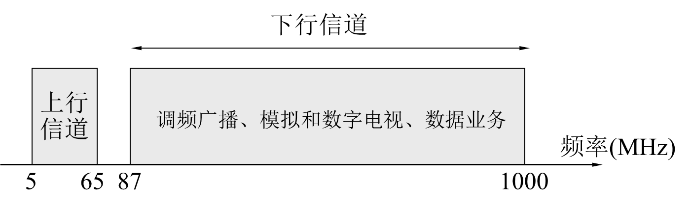

  - 每个家庭要安装一个用户接口盒UIB（User Interface Box），提供三种连接，即：

    - 使用同轴电缆链接到**机顶盒**（set-top box），然后再连接到用户的电视机。
    - 使用双绞线连接到用户的电话机。
    - 使用电缆调制解调器连接到用户的计算机。

### 2.6.3 FTTX技术

- 光纤到户FTTH（Fiber To The Home）：光纤一直铺设到用户家庭可能是居民接入网最后的解决方法。

- 光纤到大楼FTTB（Fiber To The Building）：光纤进入大楼后就转换为电信号，然后用电缆和双绞线分配到各用户。

- 光纤到路边FTTC（Fiber To The Curb）：从路边到各用户可使用星形结构双绞线作为传输媒体。

  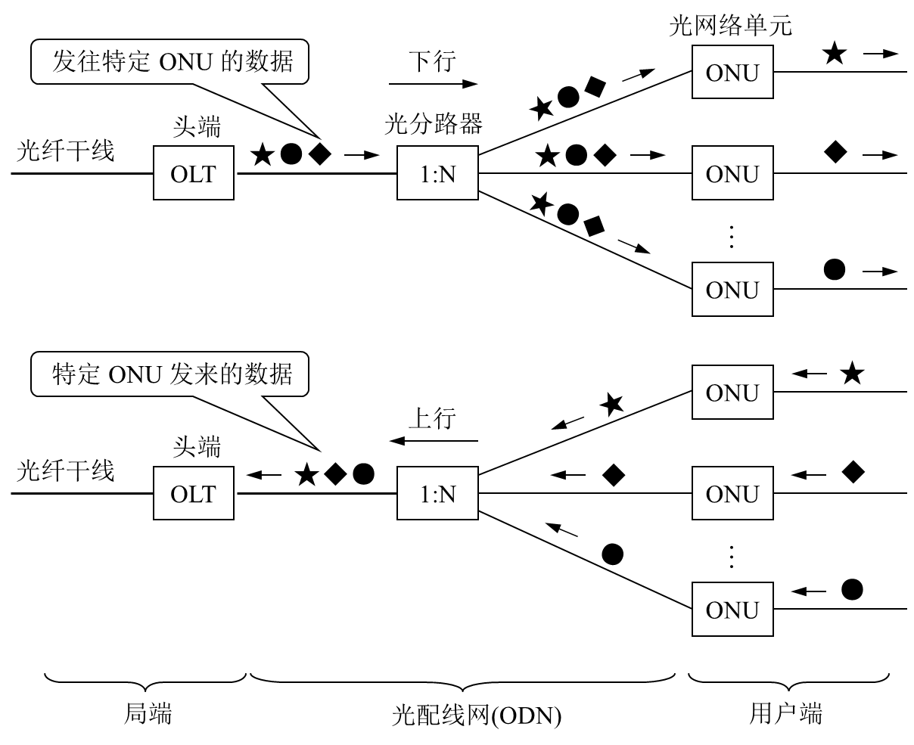

