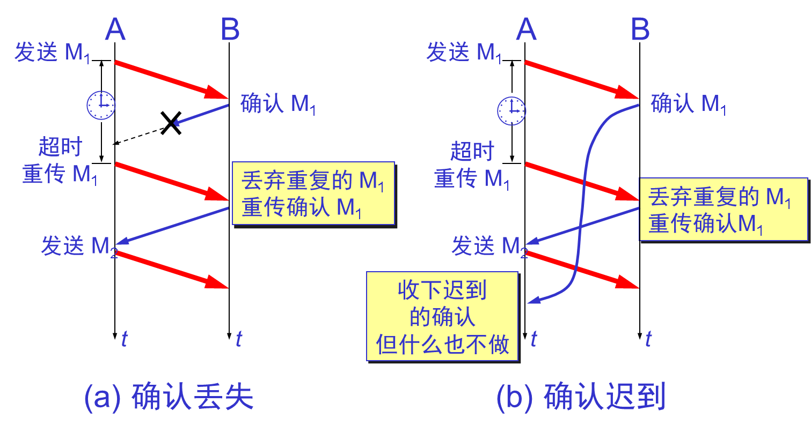

# 第五章 传输层

TCP/IP的运输层有两个不同的协议：

1. 用户数据报协议UDP（User Datagram Protocol）

   TCP提供面向连接的服务。TCP不提供广播或多播服务。由于TCP要提供可靠的、面向连接的运输服务，因此不可避免地增加了许多开销。

2. 传输控制协议TCP（Transmission Control Protocol）

   UDP在传送数据之前不需要先建立连接。对方的运输层在收到UDP报文后，不需要给出任何确认。

端口号（Protocol port number）简称端口（port）

解决这个问题的方法就是在运输层使用协议端口号，或通常简称为端口（port）。

TCP端口，用一个16位端口号进行标志。端口号只具有本地意义，即端口号只是为了标志本计算机应用层中的各进程。

三类端口：

- 熟知端口，数值一般为0-1023
- 登记端口号，数值为1024-49151
- 客户端口号或短暂端口号，数值为49152-65535

## 5.1 用户数据报协议UDP

UDP在IP数据报服务上增加了少量功能：端口功能和差错检验功能。

UDP的特点：

- UDP是无连接的，即发送数据之前不需要建立连接。
- UDP使用尽最大努力交付，即不保证可靠交付，同时也不使用拥塞控制。
- UDP是面向报文的。UDP没有拥塞控制，很适合多媒体通信的要求。
- UDP支持一对一、一对多、多对一和多对多的交互通信。
- UDP的首部只有8个字节，开销小。

面向报文的UDP

- 发送方UDP对应用程序交下来的报文，在添加首部后就向下交付IP层。UDP对应用层交下来的报文，既不合并，也不拆分，而是保留这些报文的边界。
- 应用层交给UDP多长的报文，UDP就照样发送，即一次发送一个报文。
- 接收放UDP对IP层交上来的UDP用户数据报，在去除首部后就原封不动地交付上层的应用进程，一次交付一个完整的报文。
- 应用程序必须选择合适大小的报文。

UDP的首部格式：

UDP基于端口的分用：

UDP的字段：数据字段和首部字段

首部字段由8个字节，4个字段，每字段两个字节。

## 5.2 传输控制协议TCP

### 5.2.1 TCP的特点

- TCP是**面向连接**的运输层协议。

- 每一条TCP连接只能有两个**端点（endpoint）**，每一条TCP连接只能是点对点的（一对一）。

- TCP提供**可靠交付**的服务。

- TCP提供**全双工**通信。

- **面向字节流**。

  

### 5.2.2 TCP的连接

- TCP 把连接作为最基本的抽象。

- 每一条TCP连接有两个端点。

- TCP连接的端点叫做**套接字（socket）**或**插口**。

- 端口号**拼接到**IP地址即构成套接字。

  

### 5.2.3 停止等待协议

**自动重传请求ARQ（Automatic Repeat reQuest）**

### 5.2.4 连续ARQ协议

**累计确认**：

- 接收方一般采用累积确认的方式，即不必对收到的分组逐个发送确认，而是对按序到达的**最后一个分组**发送确认，这样就表示：**到这个分组为止的所有分组都已正确收到了**。
- 优点：容易实现，即使确认丢失不必重传。
- 缺点：不能向发送方反映出接收方已经正确收到的所有分组的信息。

### 5.2.5 TCP报文段的首部格式

### 5.2.6 以字节为单位的滑动窗口

 **流量控制**：

### 5.2.7 TCP运输连接的三个阶段

**连接建立**、**数据传送**和**连接释放**

三个问题：

- 要使每一方能够确知对方的存在。
- 要允许双方协商一些参数。
- 能够对运输实体资源进行分配。

