# 第四章 网络层

## 4.1 网络层提供的两种服务

- 虚电路服务

  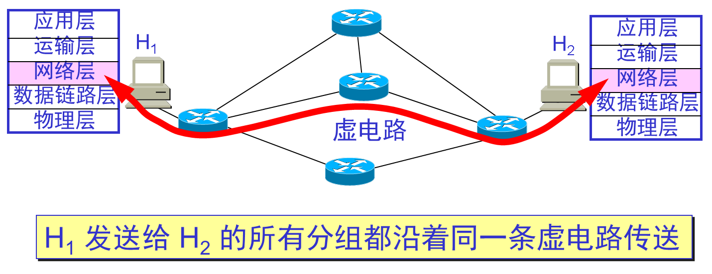

- 数据报服务

  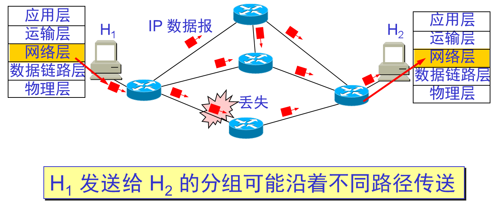

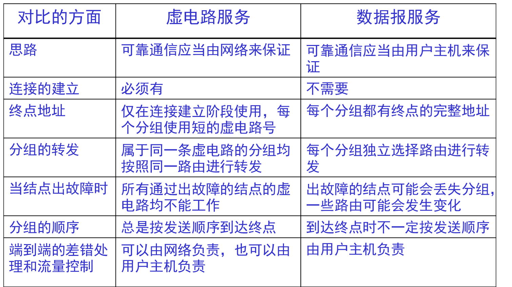

## 4.2 网际协议 IP

### 4.2.1 虚拟互联网

中间设备又称为中间系统或中继（realay）系统。

- 物理层中继系统：（集线器）转发器（repeater）

- 数据链路层中继系统：（交换机）网桥或桥接器（bridge）

- 网络层中继系统：路由器（router）

- 网络层以上的中继系统：网关（gateway）

  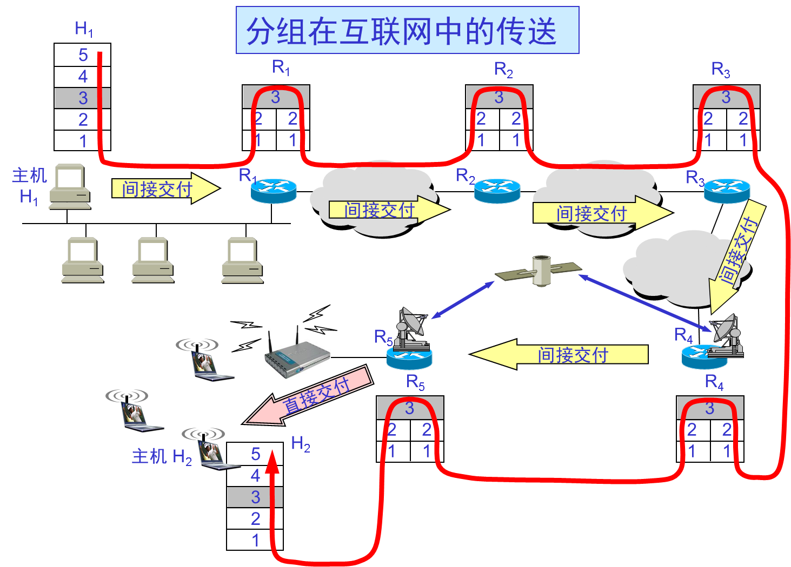

  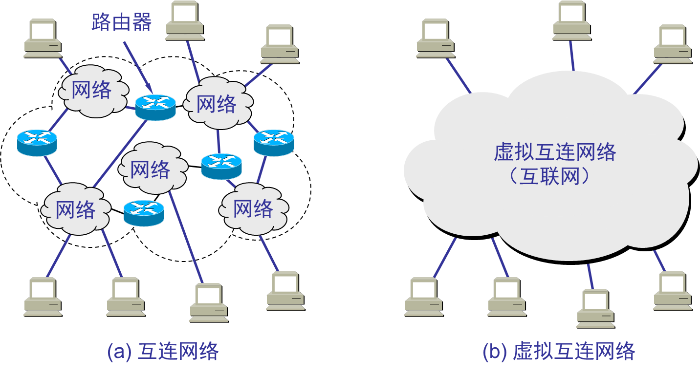

IP协议简介

网际协议IP是TCP/IP体系中两个最主要的协议之一。此外还有：

- 地址解析协议 ARP （Address Resolution Protocol）

- 逆地址解析协议 RARP （Reverse Address Resolution Protocol）

- 网际控制报文协议 ICMP （Internet Control Message Protocol）

- 网际组管理协议 IGMP （Internet Group Management Protocol）

  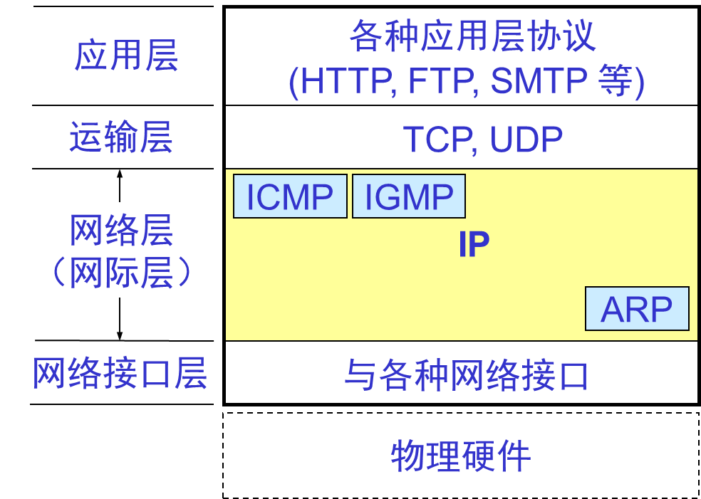

### 4.2.2 IP地址

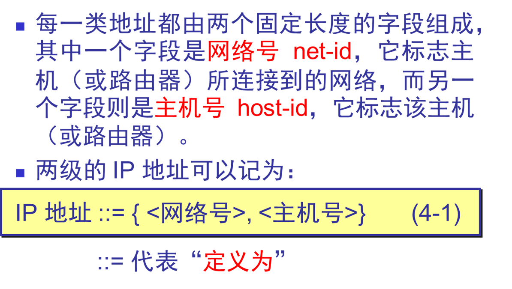

IP地址的分类：

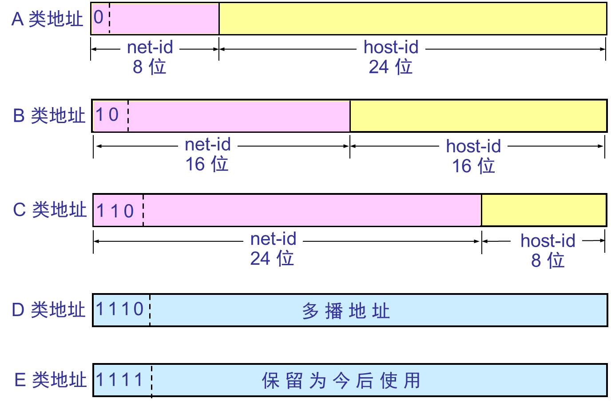

点分十进制记法：

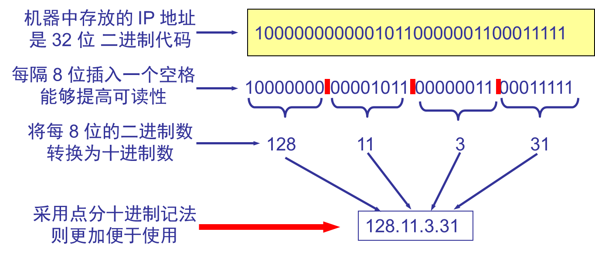

IP地址使用范围：

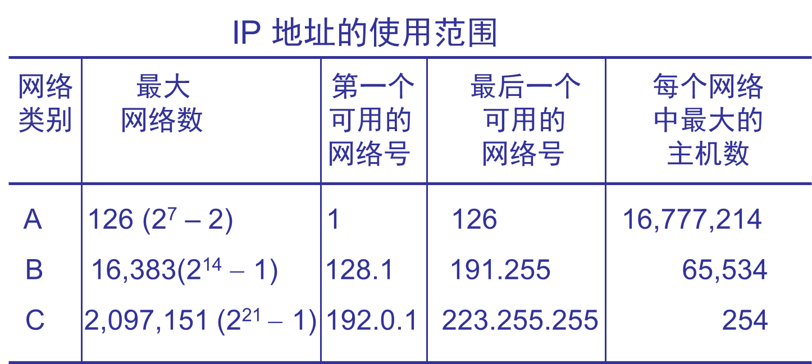

互联网中的IP地址

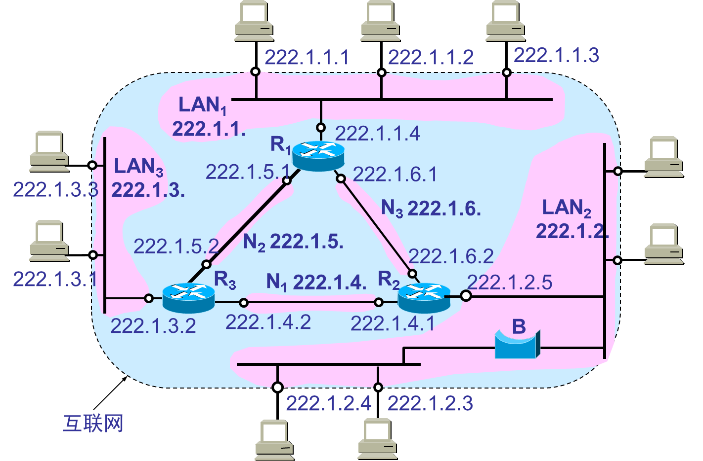

### 4.2.3 特殊的几个IP网段

127.0.0.1	本地环回地址

169.254.0.0	获取地址失败后的地址

10.0.0.0	保留的A类私网地址

172.16.0.0 —— 172.31.0.0	保留的B类私网地址

192.168.0.0——192.168.255.0	保留的C类私网地址

### 4.2.4 子网掩码作用

子网掩码和IP地址做与运算得到网短号。

**子网划分**：

地址划分后，第一个地址为网段，主机地址全为1的为广播地址，其他地址为主机地址。

**超网：**合并网段

### 4.2.5 地址解析协议 ARP

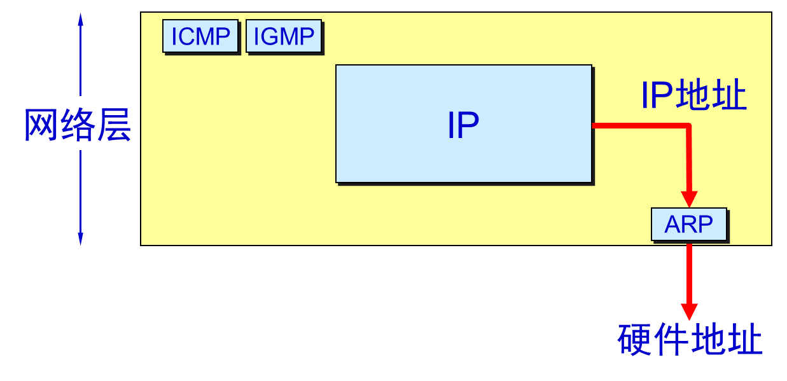

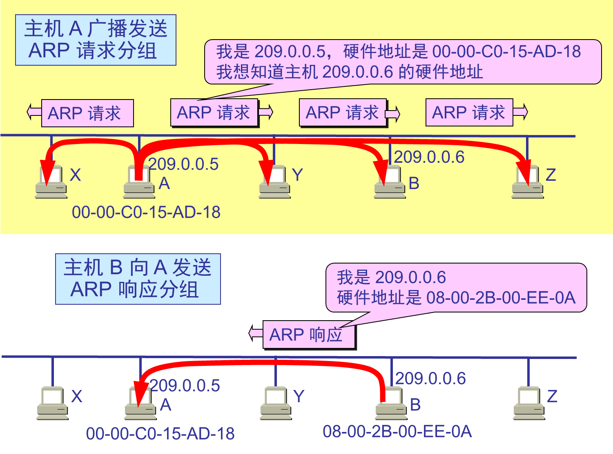

使用ARP的四种典型情况

- 发送方是主机，要把IP数据报发送到本网络上的另一个主机。这时候用ARP找到目标主机的硬件地址。
- 发送方是主机，要把IP数据报发送到另一个网络上的一个主机。这时用ARP找到本网络上的一个路由器的硬件地址。
- 发送方是路由器，要把IP数据报转发到本网络上的一个主机。这时用ARP找到目标主机的硬件地址。
- 发送方是路由器，要把IP数据报转发到另一个网络上的一个主机。这时用ARP找到本网络上另一个路由器的硬件地址。

RARP(逆向ARP)：根据物理地址寻找IP地址

### 4.2.6 IP数据报

一个IP数据报由首部和数据两部分组成。

首部的前一部分是固定长度，共20字节，是所有IP数据报必须具有的。

在首部的固定部分的后面是一些可选字段，其车昂都是可变的。

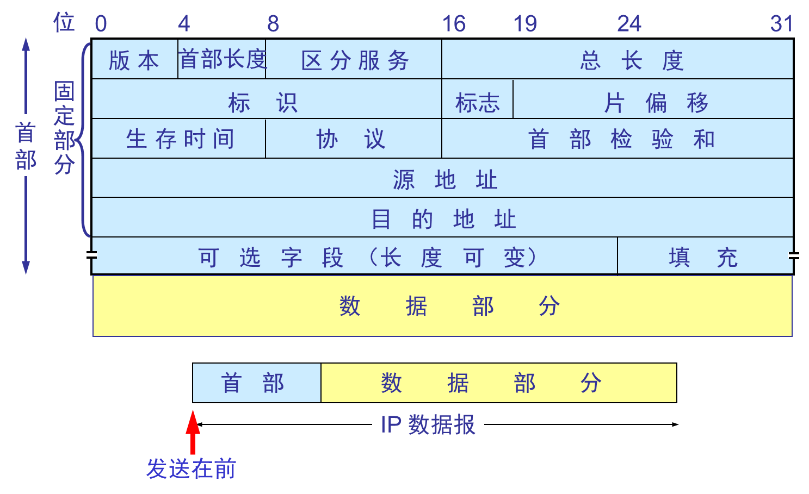

### 4.2.6 IP层转发分组的流程

数据路由：路由器在不同网段转发数据包

网络通畅的条件 能去能回

沿途的路由器必须知道到目标网络下一跳给哪个接口

沿途的路由器必须知道到源网络下一跳给哪个接口

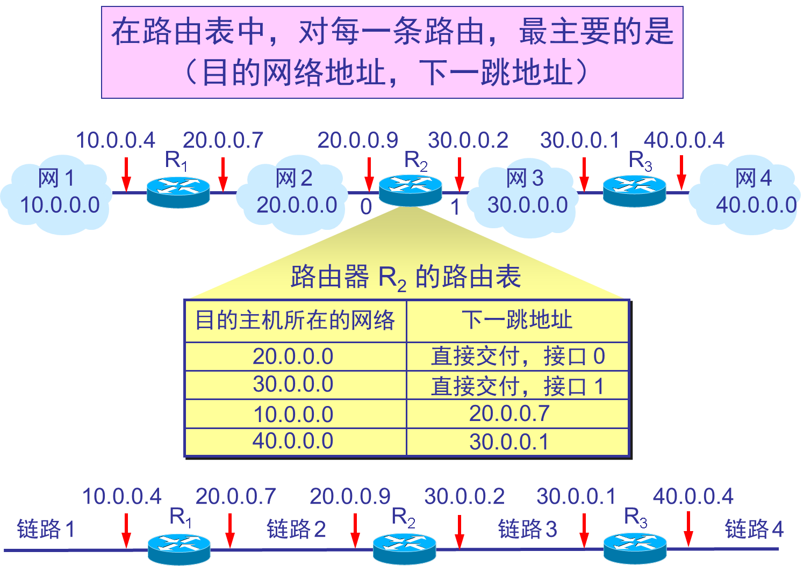

分组转发算法：

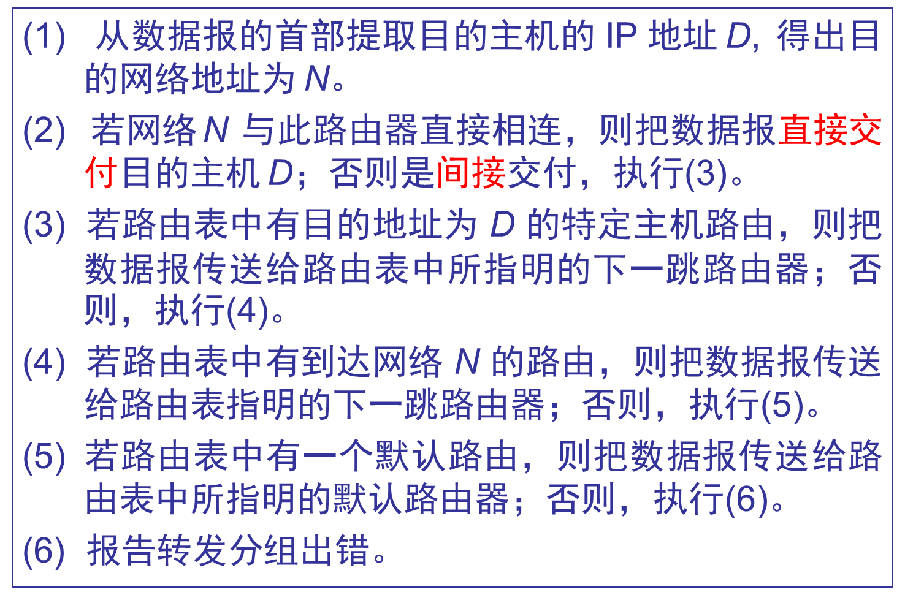

## 4.3 网际控制报文协议 ICMP

为了提高IP数据报交付成功的机会，在网际层使用了网际控制报文协议ICMP（Internet Control Message Protocol）

ICMP允许主机或路由器报告差错情况和提供有关异常情况的报告。

ICMP不是高层协议，而是IP层的协议。

ICMP报文作为IP层数据报的数据，加上数据报的首部，组成IP数据报发送出去。

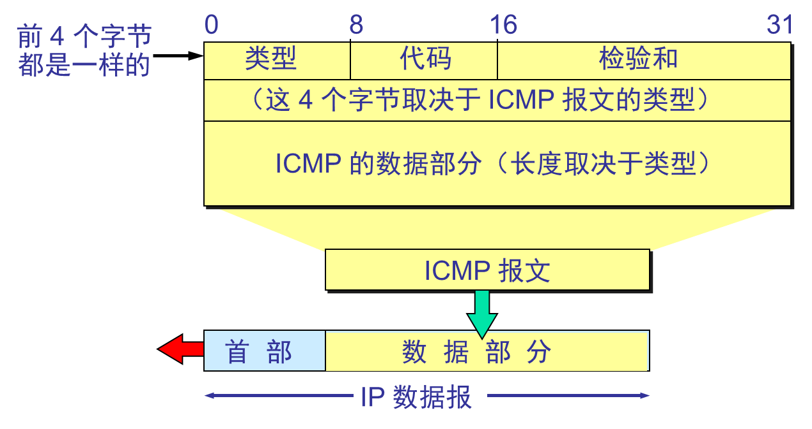

ICMP报文的种类有两种，即**ICMP差错报告报文**和**ICMP询问报文**。

ICMP报文前4个字节是统一的格式，共有三个字段：即**类型**、**代码**和**检验和**。

**ICMP差错报文**有五种：终点不可达，源点抑制，时间超过，参数问题，改变路由（重定向）

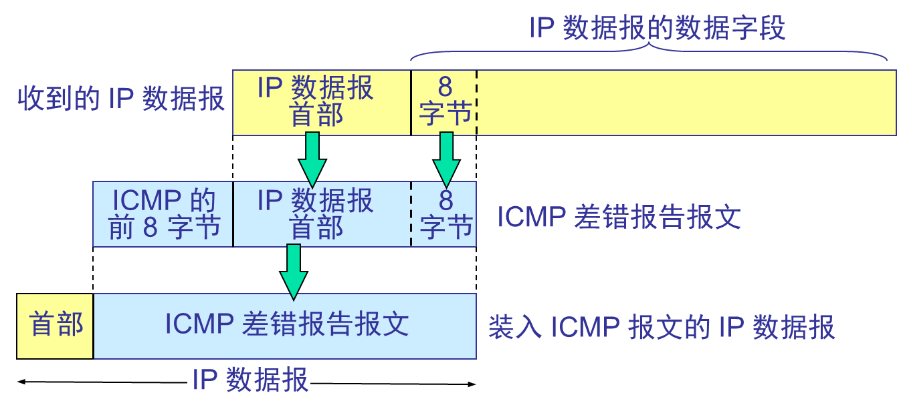

**ICMP询问报文**有两种：回送请求和回答报文、时间戳请求和回答报文

ping使用了ICMP回送请求与回送回答报文，没有通过运输层的TCP或UDP。

## 4.4 因特网的路由选择协议

**静态**路由选择策略——即非自适应路由选择，其特点是简单和开销较小，但不能及时适应网络状态的变化。

**动态**路由选择策略——即自适应路由选择，其特点是能较好地适应网络状态的变化，但实现起来较为复杂，开销也较大。

**自治系统AS**：在单一的技术管理下的一组路由器，而这些路由器使用一种AS内部的路由选择协议和共同的度量以确定分组在该AS内的路由，同时还使用一种AS之间的路由选择协议用以确定分组在AS之间的路由。

**内部网关协议IGP**：即在一个自治系统内部使用的路由选择协议。目前这类路由选择协议使用得最多，如RIP和OSPF协议。

**外部网关协议EGP**：若源站和目的站处在不同的自治系统中，当数据报传到一个自治系统的边界时，就需要使用一种协议将路由选择信息传递到另一个自治系统中。这样的协议就是外部网关协议EGP。在外部网管协议中目前使用最多的是BGP-4。

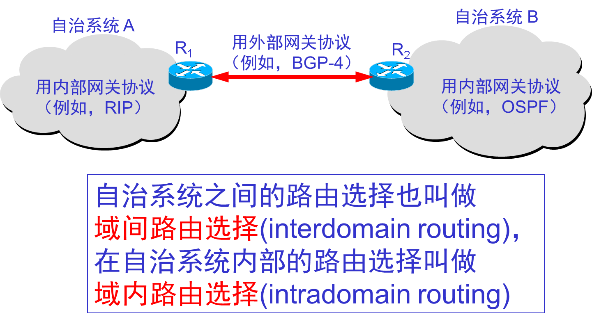

### 4.4.1 内部网关协议RIP

1. 工作原理

   - 路由信息协议RIP是内部网关协议IGP中最先得到广泛使用的协议。

   - RIP是一种分布式的基于**距离向量**的路由选择协议。（“距离”也称“跳数”，每过一个路由器，条数加1。RIP最多允许15个路由器）

   - RIP协议要求网络中的每一个路由器都要维护从它自己到其他每一个目的网络的距离记录。

     三个要点：

     - 仅和**相邻路由器**交换信息。
     - 交换的信息是当前本路由器所知道的**全部信息**，即自己的路由表。
     - 按固定的时间间隔**交换路由信息**。

2. 距离向量算法

   收到相邻路由器（地址为X）的一个RIP报文

   1. 先修改此RIP报文中的所有项目：把“下一跳”字段中的地址都修改为X，并把所有的“距离”字段的值加1.
   2. 对修改后的RIP报文中的每一个项目，重复以下步骤：
      - 若项目中的目的网络不在路由表中，则把该项目加到路由表中。
      - 否则：
        - 若下一跳字段给出的路由器地址是同样的，则把收到的项目替换原路由表中的项目。
        - 若收到项目中的距离小于路由表中的距离，则进行更新，否则，什么都不做。
   3. 若3分钟还没有收到相邻路由器的更新路由表，则把此相邻路由器记为不可达路由器，即将举例设为16
   4. 返回

### 4.4.2 RIP2协议的报文格式

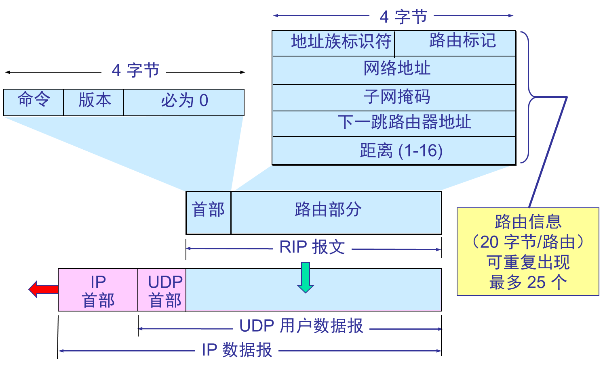

- RIP2报文中的路由部分由若干路由信息组成。每个路由信息需要用20个字节。地址族标识符（又称地址类别）字段用来标识所使用的地址协议。
- 路由标记填入自治系统的号码，这是考虑RIP有可能收到本自治系统以外的路由选择信息。
- RIP协议的优缺点：
  - RIP存在的一个问题是当网络出现故障时，要经过比较长的时间才能将此信息传送到所有的路由器。
  - RIP协议最大的优点就是实现简单，开销较小。
  - RIP限制了网络的规模，它能使用的最大距离为15.
  - 路由器之间交换的路由信息是路由器中完整路由表，因而随着网络规模的扩大，开销也就增加。

### 4.2.3 内部网关协议OSPF（Open Shortest Path First）

1. OSPF协议的基本特点

   - “开放”表面OSPF协议不是受某一家厂商控制，而是公开发表的。
   - “最短路径优先”是因为使用了Dijkstra提出的最短路径算法SPF
   - OSPF只是一个协议的名字，它并不表示其他的路由选择协议不是“最短路径优先”
   - 是分布式的**链路状态协议**。

2. 三个要点

   - 向本自治系统中所有路由器发送信息，这里使用的方法是洪范法。
   - 发送的信息就是与本路由器**相邻**的所有路由器的链路状态，但这只是路由器所知道的部分信息。
   - 只有当链路状态**发生变化**时，路由器才用洪范法想所有路由器发送此信息。

3. OSPF划分区域

   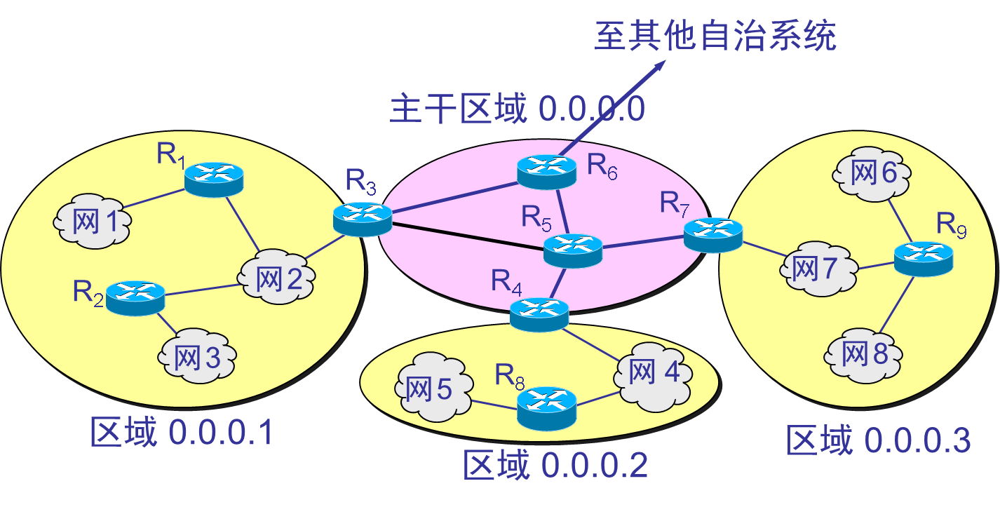

4. OSPF分组

   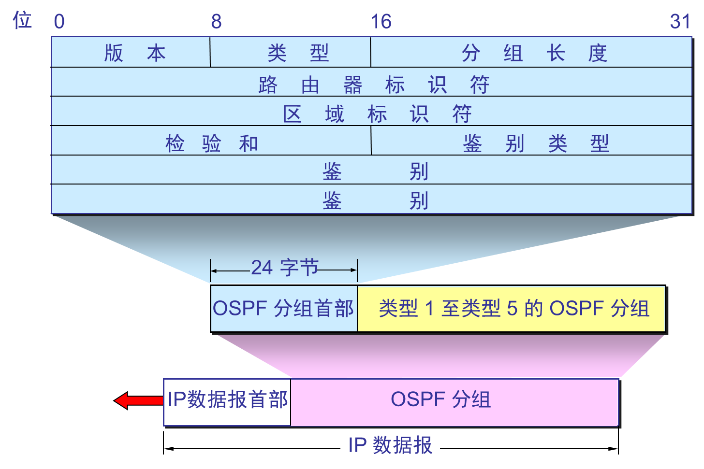

5. OSPF的五种分组类型

   1. 问候分组（Hello）
   2. 数据库描述分组（Database Description）
   3. 链路状态请求分组（Link State Request）
   4. 链路状态更新分组（Link State Update）
   5. 链路状态确认分组（Link State Ackonwledgment）

6. OSFP的基本操作

   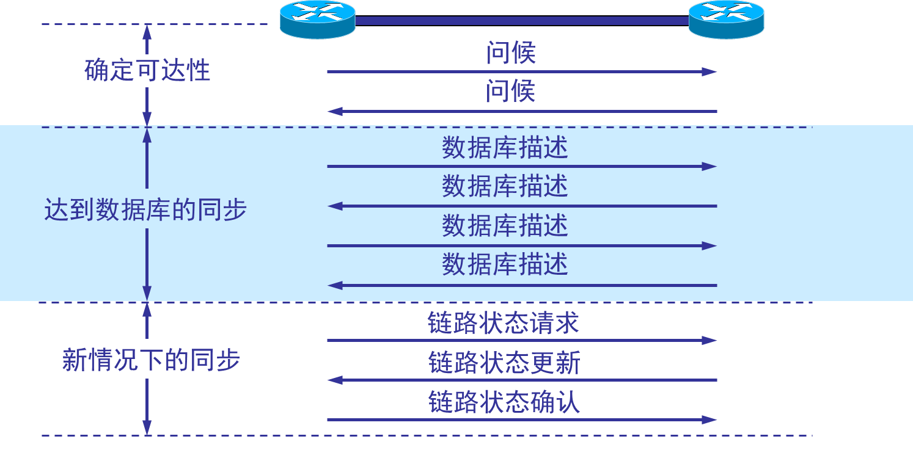

   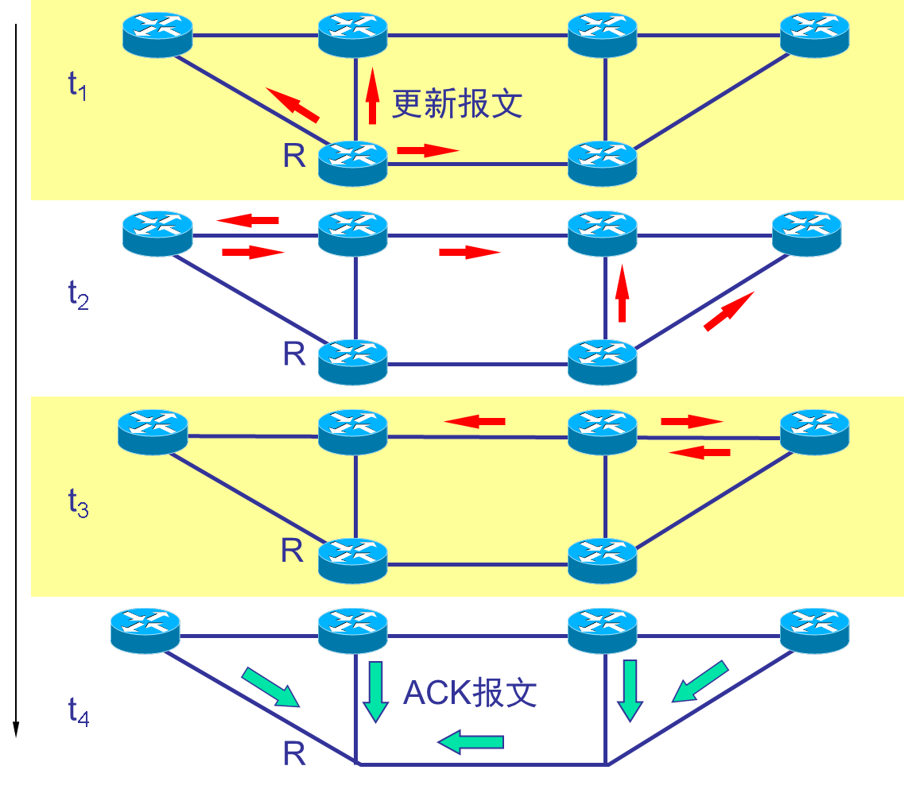

### 4.2.4 外部网关协议BGP

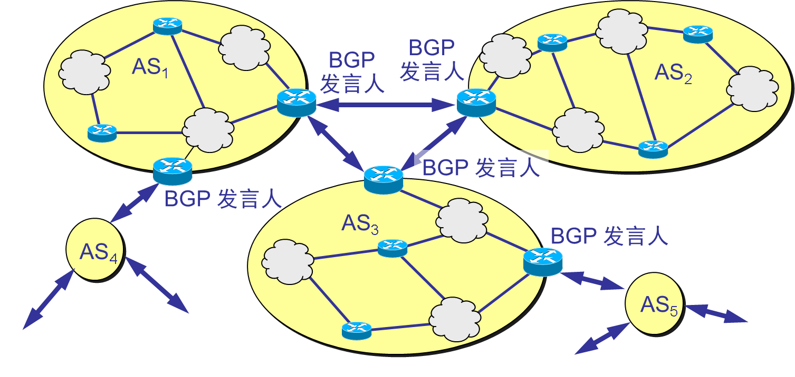

## 4.5 IP多播

IP多播需要两种协议

- 为了使路由器知道多播组成员的信息，需要利用**网际组管理协议IGMP（Internet Group Management Protocol）**
- 连接在局域网上的多播路由器还必须和因特网上的其他多播路由器协同工作，以便把多播数据报用最小代价传送给所有的组成员。**多播路由选择协议**。

## 4.6 虚拟专用网VPN和网络地址转换NAT

### 4.6.1 虚拟专用网VPN

**本地地址**——仅在机构内部使用的IP地址，可以由本机构自行分配，而不需要向因特网的管理机构申请。

**全球地址**——全球唯一的IP地址，必须向因特网的管理机构申请。

RFC1918 指明的专用地址

10.0.0.0	到	10.255.255.255

172.16.0.0	到	172.31.255.255

192.168.0.0	到	192.168.255.255

用隧道技术实现虚拟专用网

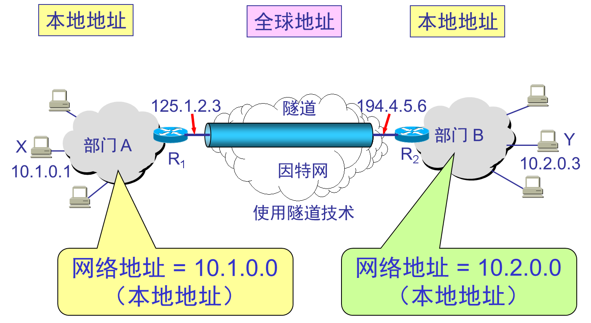

### 4.6.2 网络地址转换NAT

- 内部主机X用本地地址IPx和因特网上主机Y通信所发送的数据报必须经过NAT路由器。
- NAT路由器将数据报的源地址IPx转换成全球地址IPg，但目标地址IPy保持不变，然后发送到因特网。
- NAT路由器收到主机Y发回的数据报时，知道数据报中的源地址是IPy而目标地址是IPg。
- 根据NAT转换表，NAT路由器将目标地址IPg转换为IPx，转发给最终的内部主机X。

